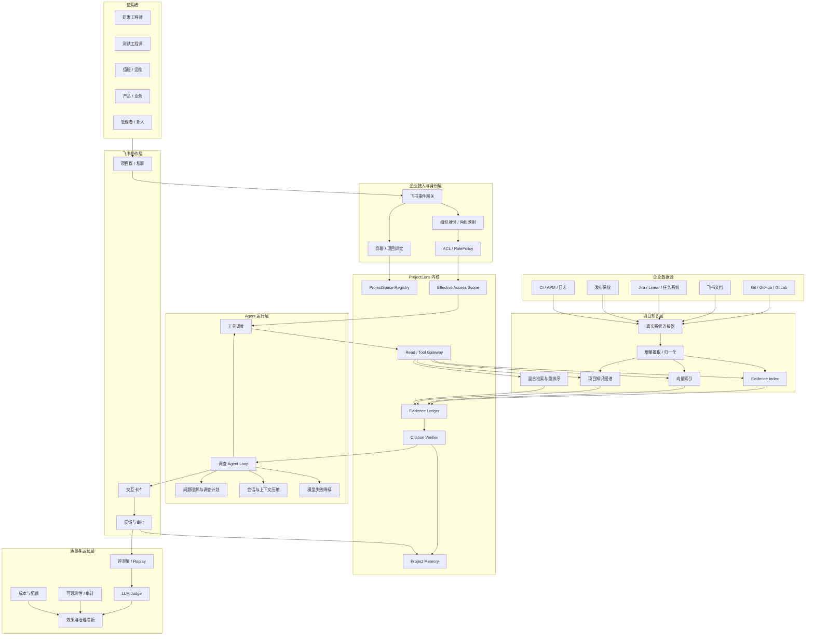
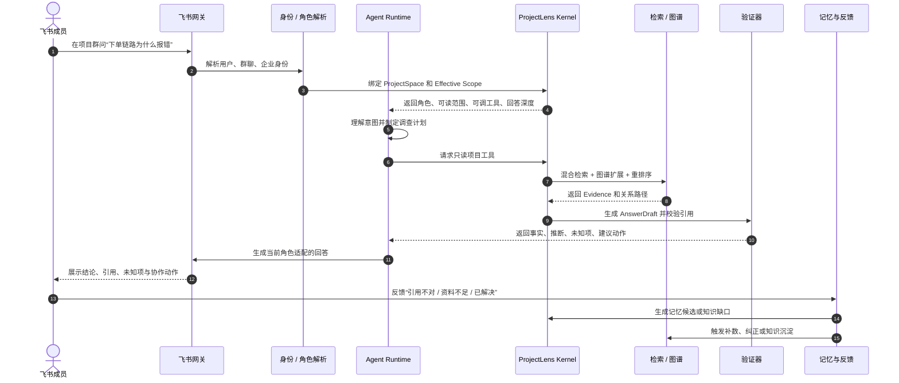
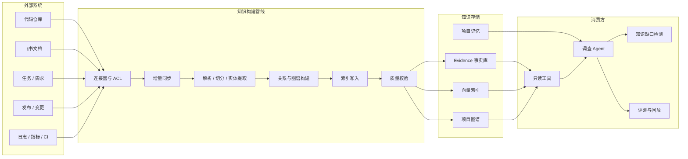

# ProjectLens 企业版目标架构

本文描述的不是当前代码的现状图，而是要把 ProjectLens 真正做成企业产品时，每一层最终应该长成什么样。

## 1. 总体架构

## 2. 一次项目问题的目标工作流

## 3. 项目知识持续构建流程

## 4. 每一层最终要长成什么样

| 层级 | 最终状态 | 判断标准 |
| --- | --- | --- |
| 身份与权限 | 企业身份进入运行时，角色不能由客户端自行声明 | 同一用户在项目群和私聊、不同角色得到真实且一致的权限 |
| ProjectSpace | 通过配置接入真实项目，不修改 Agent 代码 | 一个企业项目能在限定时间内完成 onboarding |
| 知识摄取 | 支持 Git、文档、任务、发布、运维信号增量同步 | 新提交和文档变更可被检索和追踪 |
| 检索 | BM25、向量、图谱联合检索，并做重排序 | 黄金问题命中率持续提升，引用不相关率下降 |
| 图谱 | 从代码调用、依赖、变更、事故中构建可解释关系 | 能回答“谁依赖谁、改了哪里、影响哪里” |
| Agent Runtime | 调查计划由模型决定，ProjectLens 控制权限和验证 | 未预置问题也能进入工具循环，而不是走固定模板 |
| 答案生成 | 同一事实核心按角色生成，事实、推断、未知分离 | 技术、业务、管理、新人第一次看到的内容就不同 |
| 飞书协作 | 不只回答，还支持反馈、审批、负责人协同、记忆沉淀 | 用户完成一次问题闭环不需要离开飞书 |
| 评测运营 | 有真实评测集、回放、LLM Judge、成本和效果看板 | 每次改动都能证明是否让产品变得更有用 |
