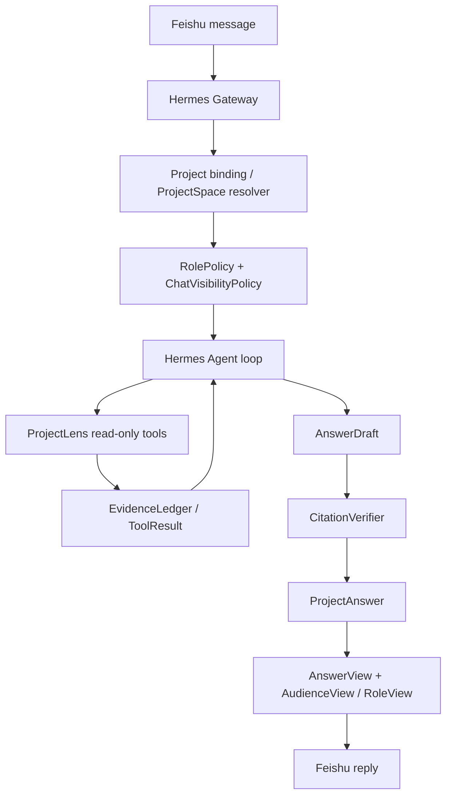

# ProjectLens 最终架构规划（Hermes-based + 可插拔 ProjectSpace）

更新时间：2026-08-05

这是当前的 canonical 规划文档。后续如果再改方向，先改这份，再同步 `docs/cursor-development-plan.md`、`docs/project-learning-journal.md` 和 `docs/projectlens-next-plan-simple.md`。

## 0. 2026-08-05 方向冻结：先把产品纠偏回来

本次确认的核心判断是：ProjectLens 后续不能继续沿着“`/project` 命令 + 固定 Skill 流水线 + 通用答案 + 卡片角色过滤”的方向加厚。

后续所有开发必须遵守以下 6 条硬约束：

1. **Hermes 最终主导 Agent loop**：Hermes 负责对话、模型调用、工具循环、session、profile、飞书网关和上下文压缩。
2. **ProjectLens 收敛为项目智能内核**：ProjectLens 负责 ProjectSpace、RAG/GraphRAG、Evidence、权限、角色策略、引用校验、项目记忆和只读项目工具。
3. **`/project` 降级为 debug 入口**：正式产品体验是飞书自然语言项目问答，不要求用户记 slash command。
4. **先做 ProjectSpace / RolePolicy，不继续堆卡片**：先解决“当前是什么项目、这个人能看什么、这个群能展示什么”，再谈飞书展示体验。
5. **角色权限必须在生成前进入运行时**：不能先生成一份通用答案再用 RoleView 过滤；Agent 调查前就必须知道 actor、role、chat visibility 和 effective access scope。
6. **短期不碰代码修改能力**：Apply / PR / deploy / rollback / restart 继续关闭，先把只读项目协作问答做扎实。

这意味着新的产品主线是：

```text
Feishu 自然语言消息
-> Hermes Runtime
-> ProjectLens Context Resolver
-> ProjectSpace + RolePolicy + ChatVisibilityPolicy
-> Hermes-driven ProjectLens read-only tool loop
-> EvidenceLedger
-> AnswerDraft
-> ProjectLens Verifier
-> role-aware answer
-> Feishu reply
```

而不是：

```text
/project
-> ProjectLens workflow
-> Skill 分类
-> 通用报告
-> RoleView / 卡片按钮过滤
```

## 1. 一句话结论

ProjectLens 不应该继续长成“一个固定 `/project` 命令 + Skill 流水线 + 卡片过滤器”。

它应该是：

```text
Hermes Runtime + ProjectLens Kernel
```

其中：

- Hermes 负责通用 Agent 运行时：对话、工具循环、飞书网关、模型调用、session、profile、压缩、插件/MCP；
- ProjectLens 负责项目智能内核：ProjectSpace、RAG/GraphRAG、Evidence、权限、角色策略、引用校验、项目记忆；
- Hermes 决定 Agent 怎么跑；
- ProjectLens 决定这个项目里什么能读、什么能信、什么能对谁说。

## 2. 和之前计划相比，真正要纠偏的点

| 旧方向 | 现在的修正 |
|---|---|
| `/project` 是主入口 | `/project` 只保留为调试入口，正式入口是自然语言项目问答 |
| 先做 Skill 路由，再生成答案 | 先进入 ProjectAgent，再按需使用 SkillGuide 作为思考脚手架 |
| 先算一份通用答案，再用卡片切角色 | 角色/权限先进入运行时，答案从一开始就按角色生成 |
| ProjectLens 自己补全完整 runtime | 复用 Hermes runtime，只保留 ProjectLens 核心内核 |
| RoleView 负责“过滤结论” | RoleView 只负责展示翻译，不负责新事实生成 |
| 多做业务 Skill 覆盖问法 | 少做 Skill，更多做 ProjectSpace、RolePolicy、Evidence、Gateway |

## 3. 最终产品定义

> ProjectLens 是一个接入飞书、围绕当前项目空间工作的只读优先 LLM Agent；它可以在权限内自主检索文档、代码、提交、图谱、记忆和运维信号，基于 Evidence 推理回答项目问题，并在不确定时明确说明缺失资料。

## 4. 系统边界

### 4.1 Hermes 负责什么

Hermes 是通用运行时外壳，负责：

- 飞书消息接入；
- 群聊 / 私聊 / @mention / session；
- 模型 provider 调用；
- tool-calling loop；
- profile 路由；
- 上下文压缩；
- plugin / MCP；
- 通用调度和会话持久化。

Hermes 不应该直接负责：

- 项目事实建模；
- 项目知识图谱；
- 项目证据链；
- 项目角色权限；
- 项目记忆审批；
- 项目级引用校验。

### 4.2 ProjectLens 负责什么

ProjectLens 是项目内核，负责：

- ProjectSpace / ProjectRegistry；
- project 绑定；
- project 级 ACL；
- role policy；
- RAG / GraphRAG；
- Evidence / ToolResult / EvidenceLedger；
- ReadContextGateway / ToolGateway；
- CitationVerifier；
- ProjectMemoryApprovalGateway；
- AnswerView / AudienceView；
- evaluation / replay。

### 4.3 角色不是卡片过滤器

这是这次最关键的纠偏。

不要做：

```text
先生成一份通用答案
-> 再用角色卡片切技术版 / 业务版 / 管理版
```

要做：

```text
先解析 ProjectSpace + 角色 + 聊天场景权限
-> 再让 Agent 调查和生成答案
-> 最后 RoleView 只做展示翻译
```

也就是说：

- `RolePolicy` 是运行时输入；
- `RoleView` 是展示层输出；
- 不允许把角色当成后处理过滤器。

## 5. 核心数据模型

### 5.1 ProjectSpace

每个项目必须能被替换，不许写死在 Agent 里。

```text
ProjectSpace
- project_id
- tenant_id
- display_name
- repositories
- docs connectors
- task/release/incident connectors
- graph namespace
- memory namespace
- ACL policy
- file allowlist
- glossary
- skill guide bindings
```

### 5.2 ProjectMemberRolePolicy

角色策略必须前置。

```text
ProjectMemberRolePolicy
- actor_id
- project_id
- role
- readable_sources
- allowed_tools
- forbidden_sources
- answer_depth
- answer_style
- evidence_visibility
- escalation_rules
```

### 5.3 ChatVisibilityPolicy

群聊和私聊要分开。

```text
chat_id -> ProjectSpace + ChatVisibilityPolicy
user_id -> ProjectSpace + MemberRolePolicy
effective_scope = user_scope ∩ chat_scope
```

### 5.4 Answer contract

事实核心不变，展示可以分层。

```text
ProjectAnswer
- facts
- inferences
- unknowns
- next_actions
- citations
- evidence_ledger_refs
```

展示层拆成两维：

- `AnswerView`：这是什么类型的问题；
- `AudienceView` / `RoleView`：这份答案给谁看。

## 6. 目标运行链路



核心变化：

```text
现在偏航：workflow 先算结论，LLM 后润色
目标态：LLM 先规划读什么，Harness 负责边界、审计和校验
```

## 7. Skill 的新定位

Skill 不再是业务桶，也不再是主路由。

它只是：

```text
SkillGuide = checklist / 输出结构建议 / 常见排查脚手架
```

例如：

- 项目介绍：先查 README、服务列表、入口、负责人；
- 故障排查：先查错误栈、最近变更、相关模块、短时窗 ops signal；
- 项目理解：先查架构、依赖、图谱、知识缺口。

自由项目问题不命中任何 Skill，也应该能进入 ProjectAgent。

## 8. 最小可行阶段规划

### Phase 0：方向冻结

目标：先停止继续堆 Skill 和卡片模板。

产物：

- 更新主规划文档；
- 明确 Hermes Runtime + ProjectLens Kernel；
- 明确角色前置于运行时；
- 明确 `/project` 只做调试入口。

### Phase 1：ProjectSpace / RolePolicy

目标：让“项目可插拔、角色可前置”先成立。

产物：

- `ProjectSpace` 注册表；
- `ProjectMemberRolePolicy`；
- `ChatVisibilityPolicy`；
- 至少两个 project fixture；
- 至少两种角色策略。

验收：

- 同一 Agent 壳可切换两个 ProjectSpace；
- 同一问题在不同角色下读到的范围不同；
- 不改 Agent 代码即可换项目。

### Phase 2：Hermes 自然语言入口 + 受限 ProjectLens 工具层

目标：让飞书自然语言项目问题能进入 Hermes 的 ProjectLens-safe 运行环境；`/project` 保留为 debug / smoke，不再作为正式产品主入口。

产物：

- chat_id -> ProjectSpace binding；
- actor_id -> ProjectMemberRolePolicy binding；
- ChatVisibilityPolicy；
- Hermes plugin / MCP 胶水；
- ProjectLens read-only toolset 初版；
- restricted profile/toolset；
- `/project` debug 入口继续可用，但正式群聊自然语言不依赖它；
- 不允许 Hermes 默认满血工具集进入项目群。

验收：

- 飞书项目群中自然语言问题可以解析到 ProjectSpace；
- Hermes 只能触发 ProjectLens 暴露的只读工具；
- 不能绕过 Gateway 直读存储；
- 不能使用 Hermes file/terminal/write 类工具直接读写项目；
- 不能打开 Apply。

### Phase 3：Hermes-driven read-only ProjectAgent loop

目标：让 Hermes 的 LLM tool loop 真正决定下一步读什么；ProjectLens 只负责项目工具、权限、Evidence 和 Verifier。

产物：

- `ProjectInvestigationAgent` 可继续作为 fallback / local test path，但不是长期主运行时；
- Hermes 可调用 `projectlens_search_context` / `projectlens_read_project_file` / `projectlens_query_graph` / `projectlens_authorized_evidence` / `projectlens_list_knowledge_gaps`；
- ToolGateway / ReadContextGateway 记录审计；
- `AnswerDraft -> Verifier -> ProjectAnswer`。

验收：

- 未预置问题不命中任何 Skill，也能触发 Hermes 对 ProjectLens 只读工具的调用；
- fact 必须有 citation；
- 无证据 fact 自动降级为 hypothesis / unknown；
- ProjectLens ask API 仍可回归测试，但不再定义最终产品体验。

### Phase 4：AnswerView + AudienceView

目标：让同一份事实核心，按不同受众表达。

产物：

- `AnswerView`：问题类型；
- `AudienceView` / `RoleView`：阅读对象；
- 默认首屏只展示结论、影响、未知项、下一步；
- 证据折叠，不抢首屏。

验收：

- 技术/业务/管理/新人看到的不是同一张“报告模板”；
- 事实核心一致，表达不同；
- 角色不是按钮过滤器。

### Phase 5：协作与记忆

目标：从问答走向团队协作。

产物：

- ProjectMemoryApproval；
- 变更 / 事故 / 决策沉淀；
- 知识缺口闭环；
- evaluation / replay。

## 9. 绝对不要再做的事

- 不要继续新增业务 Skill 来覆盖问法；
- 不要把角色设计成卡片过滤按钮；
- 不要把 `/project` 变成唯一产品入口；
- 不要让 Feishu adapter 直接读知识库；
- 不要打开 Apply / PR / deploy / rollback / restart；
- 不要为了好看把证据、trace、Skill、audit 堆满首屏；
- 不要在 Hermes core 里硬 fork 出一套 ProjectLens 专用 runtime；
- 不要在 ProjectLens 里重复造完整通用 Agent 外壳。

## 10. 这版规划给 Cursor 的一句话

```text
先冻结方向：Hermes 负责 runtime，ProjectLens 负责 project kernel；角色必须前置到运行时，不要再做“通用答案 + 卡片过滤”；接下来先落 ProjectSpace / RolePolicy，再接 read-only Agent loop，最后才做展示层。
```
