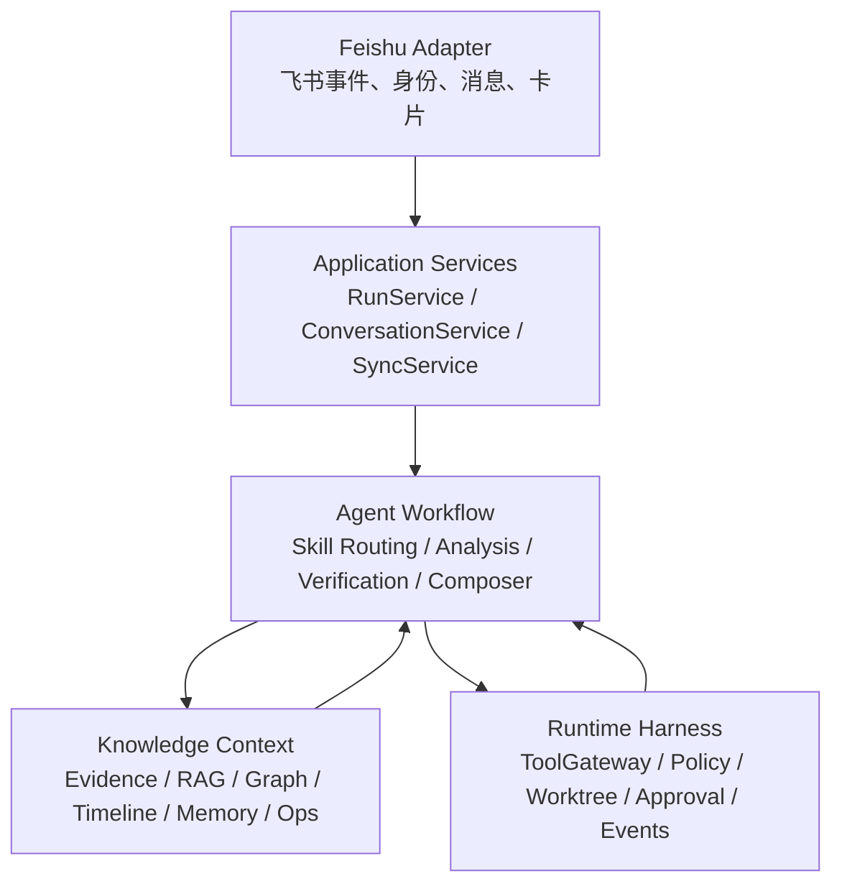

# ProjectLens 项目学习与面试复盘手册

这个文档是给项目作者自己看的，不是普通开发计划，也不是 Cursor 任务清单。

它的目标是：随着 ProjectLens 持续开发，把“每一步为什么做、做了什么、解决了什么问题、以后面试怎么讲”沉淀下来，避免项目越做越快之后，自己反而忘了设计细节。

建议每完成一轮 Cursor / Codex 开发，就更新一次本文档。

---

## 2026-08-06：Phase 3.1 续——规则 `_plan()` 换成 Hermes LLM tool loop

### 本次做了什么

把 `FeishuHermesToolLoopBridge` 里的轻量规则 planner（`_plan()`）删掉，换成可注入的 `HermesLoopRunner`：

- 生产：`HermesAIAgentLoopRunner` → Hermes `AIAgent` + `enabled_toolsets=["projectlens"]`
- 测试：Fake runner 证明工具选择来自 runner，不是旧规则（例如对含 `.py` 路径的问题只选 `authorized_evidence`）
- Hermes 不可用：显式 `ok=false`，不 silent fallback 到规则 planner

开关仍默认关闭：`PROJECT_LENS_FEISHU_USE_HERMES_TOOL_LOOP`。

### 为什么重要

入口桥接已通之后，真正决定“下一步读什么”的必须是 Hermes LLM/tool loop，而不是 ProjectLens 自己写死关键词。ProjectLens 继续只做 Kernel：Tool Envelope、RolePolicy、ChatVisibility、citations / evidence_refs / audit_ref、`allow_apply=false`。

### 硬边界

- 不改 Hermes core
- 不直连 EvidenceIndex / GraphStore / filesystem
- 不做新卡片 / Skill / session 深接 / AgentRun 持久化
- Apply / PR / deploy / rollback / restart 继续关闭

### 面试一句话

> 飞书自然语言项目问题在开关打开后进入 Hermes AIAgent 只读 tool loop；工具权限在 Tool Envelope 执行前就按 ProjectSpace/角色/群聊算好，失败不回退到规则伪装。

---

## 2026-08-05：Phase 2 第一刀——自然语言飞书入口地基

### 本次做了什么

这次把飞书入口判断从 `FeishuEventService` 里的散落 if 逻辑，收拢成了一个独立入口路由器：

```text
src/project_lens/integrations/feishu/ingress.py
```

它负责判断一条飞书消息属于：

- 机器人元问题；
- 文档同步状态；
- 非项目闲聊；
- 自然语言项目问题；
- `/project ...` debug 命令。

同时新增了运行审计标记：

```text
entry_mode=natural_project_question
entry_mode=debug_slash
```

自然语言项目问题会标记为正式入口；`/project ...` 仍然可用，但只作为 debug / smoke 入口。

### 为什么这一步重要

之前用户容易感觉自己是在“调用 Hermes 里的 `/project` 插件”。这次开始把产品入口纠偏回：

```text
用户在飞书项目群自然提问
-> 系统自动进入 ProjectLens 项目上下文
```

这一步还没有进入 Hermes-driven tool loop，也没有改卡片和 RoleView。它只是先把入口语义立住，避免后续继续围绕 slash command 开发。

### 已验证结果

```text
tests/test_feishu_http_and_acl.py
tests/test_feishu_collaboration_gate.py
tests/test_feishu_integration.py

41 passed
ruff: All checks passed
```

### 面试可以怎么讲

> 我把 `/project` 从正式产品入口降级成 debug 入口，并抽出了 FeishuIngressRouter。这样飞书自然语言项目问题会被标记为 `natural_project_question`，而 `/project ...` 只标记为 `debug_slash`。这一步的意义是把用户心智从“调用一个插件命令”转回“在项目群自然问项目问题”，同时保留开发调试能力。

## 2026-08-05 补记：入口 Router 必须进入主链路，否则只是“有组件、没产品路径”

今天检查后发现 `FeishuIngressRouter` 已经有独立单测，但 `FeishuEventService` 主流程仍在直接调用旧的 intent/command 判断，`RunService.create` 也还没有记录 `entry_mode`。这说明之前的 Phase 2 在产品闭环上还差一刀：组件存在，不代表用户真实路径已经走到它。

本次修正后：

- 飞书自然语言项目问题会记录 `entry_mode=natural_project_question`；
- `/project ...` 只作为 debug/smoke 入口，创建 run 前会剥离 `/project` 前缀；
- 当 `agent_mode=read_agent` 时，飞书自然语言项目问题可以进入 `ProjectInvestigationAgent`，回答 skill 为 `project_investigation`；
- RolePolicy、RoleView、Apply 关闭边界均未改变。

这个点面试时可以这样讲：我不只是做了一个入口分类器，而是把入口分类、运行模式和只读调查 Agent 接成了可验证链路，避免系统停留在“架构图很好看，但飞书里还是旧 workflow”的状态。

## 2026-08-05 补记：上线测试前要能看见当前运行模式

为了让 read_agent 灰度不靠猜，本次把 `/api/v1/integrations/feishu/status` 扩展成 Day-0 自检入口。现在它会返回：

- `agent_mode`：飞书自然语言消息当前走 `workflow` 还是 `read_agent`；
- `ask_agent_mode`：Hermes/MCP ask 路径是否固定为 `read_agent`；
- `model_provider` / `model_live` / `model_name`：当前是否真的打开 live LLM；
- `binding_count` / `outbound_mode` / `webhook_path`：飞书联调基础状态。

这一步的产品意义是：灰度上线测试时，先确认“入口模式、模型模式、飞书绑定”三件事，再去群里提问。否则很容易出现用户以为在测 LLM 项目 Agent，实际服务还跑在旧 workflow 或 stub 配置里的情况。

新增文档：`docs/read-agent-feishu-grey-release.md`。这份文档是后续飞书 read_agent 测试的操作手册。

## 2026-08-05 补记：Tool Envelope 是 Hermes 接入的真正地基

本次新增了 ProjectLens Tool Envelope 第一版。它的意义不是“又加了几个 API”，而是把产品边界真正落到代码里：

```text
Hermes 可以决定调哪个项目工具；
ProjectLens 决定这个项目里什么能读、什么可信、什么能对谁说。
```

第一版只暴露 5 个 `projectlens_*` 工具：

- `projectlens_search_context`
- `projectlens_read_project_file`
- `projectlens_query_graph`
- `projectlens_authorized_evidence`
- `projectlens_list_knowledge_gaps`

每次调用都会先解析 ProjectSpace、用户角色和群聊可见性，再通过 Gateway 执行。返回结果统一是 envelope，包含 `summary`、`citations`、`evidence_refs`、`unknowns`、`audit_ref`、`visibility_scope`，而不是把内部工具结果或文件正文无脑丢给 Hermes。

这一步对项目含金量很关键：它让 ProjectLens 从“被 Hermes 调一个问答接口”变成“给 Hermes runtime 提供安全项目工具的 Kernel”。后续 Cursor 接 Hermes/MCP 时，只能沿着这个 envelope 扩展，不能绕回 `/project` 命令或直接查库。

新增文档：`docs/projectlens-tool-envelope.md`。

---

## 2026-08-05：Phase 1 第一刀——ProjectSpace 角色权限地基

### 本次做了什么

这次开始把“角色权限必须在生成前进入运行时”的设计落到代码里，但没有继续做卡片、Skill 或 `/project-*` 命令。

新增核心文件：

```text
src/project_lens/project_space/policies.py
tests/test_project_space_policies.py
```

更新了：

```text
src/project_lens/project_space/models.py
src/project_lens/project_space/registry.py
src/project_lens/project_space/__init__.py
docs/cursor-development-plan.md
```

### 新增的核心模型

```text
RoleKind
AnswerDepth
VisibilityLevel
ProjectMemberRolePolicy
ChatVisibilityPolicy
EffectiveAccessScope
ResolvedProjectRuntimeContext
ProjectRuntimeContextResolver
```

这一步让 ProjectLens 可以在 Agent 生成答案前先解析：

```text
当前项目是什么；
提问者在项目里是什么角色；
当前飞书群能展示什么；
本次实际能读哪些来源、能调用哪些只读工具、答案应该多详细。
```

### 为什么这一步重要

之前 RoleView 很容易变成“通用答案生成后的卡片过滤器”。这次新增的 policy/resolver 把角色前置到了运行时：

```text
ProjectSpace
-> ProjectMemberRolePolicy
-> ChatVisibilityPolicy
-> EffectiveAccessScope
-> Agent 调查和生成答案
```

也就是说，后续 Hermes 在调用 ProjectLens 工具前，可以先拿到 effective scope，而不是事后再靠卡片隐藏内容。

### 已验证

```text
pytest tests/test_project_space_policies.py -q
3 passed

ruff check src/project_lens/project_space tests/test_project_space_policies.py
All checks passed

pytest tests/test_project_registry.py tests/test_project_agent_ask_api.py tests/test_feishu_http_and_acl.py -q
15 passed, 1 warning

pytest tests/test_hermes_phase2_profile.py tests/test_project_investigation_agent.py -q
12 passed
```

### 面试可以怎么讲

> 我把角色权限从展示层前移到了运行时。新增了 ProjectMemberRolePolicy、ChatVisibilityPolicy 和 EffectiveAccessScope，让系统能先根据用户、项目和飞书群计算本次能读什么、能调用什么工具、答案应该多详细，再让 Agent 开始调查。这避免了先生成完整答案再靠卡片过滤的越权风险，也让后续 Hermes-driven tool loop 有了清晰的项目权限边界。

---

## 2026-08-05：产品方向纠偏——从 `/project` 插件报告回到团队项目 Agent

### 本次确认了什么

这次不是继续写代码，而是重新确认 ProjectLens 的产品主线。

之前的实现已经打通了 Hermes plugin、`/project` 命令、ProjectLens ask API、RoleView 和飞书卡片，但实际体验开始偏向：

```text
Hermes 里挂一个 ProjectLens 命令
-> 用户输入 /project
-> 系统返回项目报告
-> 卡片按钮切技术版 / 业务版 / 证据版
```

这个方向能做 demo，但不完全符合最初目标。真正想要的是：

```text
团队成员在飞书自然提问
-> 系统知道当前项目、提问者角色和群聊场景
-> Hermes 作为 Agent Runtime 自主调查
-> ProjectLens 控制项目资料、权限、证据和引用校验
-> 返回适合这个角色和场景的项目答案
```

### 为什么这一步重要

如果继续沿着旧路线做，后续很容易越做越厚：

- 更多 `/project-*` 命令；
- 更多业务 Skill；
- 更多卡片按钮；
- 更多角色视图模板；
- 但 Agent 自主调查能力、项目可插拔能力和角色权限边界没有真正变强。

这会让 ProjectLens 看起来像“接了 Hermes 的项目问答插件”，而不是一个真正的团队项目协作 Agent。

### 新的硬约束

后续所有开发必须遵守：

1. Hermes 最终主导 Agent loop；
2. ProjectLens 收敛为 kernel + tools + verifier；
3. `/project` 只保留为 debug / smoke 入口；
4. 先做 ProjectSpace / RolePolicy / ChatVisibilityPolicy，不继续堆卡片；
5. 角色权限必须在生成前进入运行时，不是生成后 RoleView 过滤；
6. 短期继续 read-only，不碰 Apply / PR / deploy / rollback / restart。

### 面试可以怎么讲

> 我在接入 Hermes 后发现，如果只是做 `/project` 命令和卡片报告，项目会退化成普通 RAG bot。所以我重新把系统分成两层：Hermes 负责通用 Agent Runtime，包括飞书网关、模型调用、工具循环、session 和 profile；ProjectLens 负责项目智能内核，包括 ProjectSpace、RAG/GraphRAG、Evidence、角色权限、引用校验和项目记忆。这样 ProjectLens 的价值不是“接了一个机器人”，而是构建了一个可插拔、可审计、按角色控制权限的团队项目协作内核。

### 后续参考文档

- `docs/project-agent-final-plan.md`：正式 canonical 规划；
- `docs/projectlens-next-plan-simple.md`：白话版后续计划；
- `docs/cursor-development-plan.md`：Cursor 交接执行入口。

---

## 2026-08-04：Phase 3 Hermes Plugin 从“可注册”推进到“真实 ask API smoke”

### 本次做了什么

这次继续完善的是 Hermes Plugin 胶水层的联调能力。

上一阶段已经做到：

```text
Hermes exported plugin
-> register(ctx)
-> commands: /project, /project-map, /project-gaps, /project-role
```

但这只能证明“插件能被加载和注册”，还不能证明它真的能打通 ProjectLens Kernel。

本次新增了：

```text
project_lens.integrations.hermes_plugin.smoke
```

它会模拟 Hermes 的插件加载流程：

```text
load exported plugins/projectlens/__init__.py
-> ctx.register_command(...)
-> execute /project handler
-> HTTP POST /api/v1/project-agent/ask
-> render ProjectLens answer envelope
```

### 为什么这一步重要

这一步证明 ProjectLens + Hermes 的边界设计是成立的：

- Hermes 插件仍然只是入口胶水；
- 插件没有直接读 DB / Evidence / Graph / 文件系统；
- 插件没有注册 tool / skill；
- 插件没有写 memory；
- 插件没有打开 Apply；
- 项目事实仍由 ProjectLens ask API、ProjectInvestigationAgent、Evidence 和 CitationVerifier 负责。

换句话说，现在链路已经从：

```text
“我写了一个 Hermes plugin”
```

推进到：

```text
“Hermes plugin 可以真实调用 ProjectLens Kernel，并返回有 citation/audit 的答案”
```

### 已验证结果

本地真实 smoke 已通过：

```text
ProjectLens API /docs -> 200
exported plugin path:
  C:\Users\Administrator\Desktop\hermes-agent-main\plugins\projectlens
smoke called /api/v1/project-agent/ask successfully
response included citations
response included run_id and trace_id
response kept allow_apply=false
registered commands:
  project, project-gaps, project-map, project-role
```

测试结果：

```text
tests/test_hermes_projectlens_plugin.py: 15 passed
full pytest: 411 passed, 1 warning
ruff: All checks passed
```

### 面试可以怎么讲

> Hermes 接入不是简单“接个机器人”。我把 Hermes 只作为通用 Runtime 和飞书入口，ProjectLens 仍然保留项目智能 Kernel。Phase 3 我实现了一个薄插件，它只把 Hermes slash command 转成 ProjectLens ask API 请求。为了验证边界不是纸面设计，我补了 smoke 工具：模拟 Hermes 加载插件并执行 `/project`，确认请求真实进入 ProjectLens `/api/v1/project-agent/ask`，返回结果包含 citations、run_id、trace_id，且 `allow_apply=false`。这说明 Hermes 负责入口，ProjectLens 负责项目事实和安全审计，两层边界已经跑通。

---

## 2026-08-04：Hermes Phase 1–4.5 落地 —— Spike（API/MCP/Safe Profile）+ Plugin（RoleView/飞书卡片）

### 为什么补这条复盘

源码调研（MCP first / Plugin later / Fork last）之后，真正落地的不是“接了 Hermes”，而是两层可验证交付：

1. **Spike（Phase 1–2）**：ProjectLens 先长出可被 Hermes 调用的 Kernel 接口，再配受限 profile 样例。
2. **Plugin（Phase 3–4.5）**：在 ProjectLens 仓库里提供可导出到 Hermes 的薄胶水，做 slash / RoleView / 可选飞书卡片，**仍不改 Hermes core、不 fork**。

详细操作与验收见：

```text
docs/hermes-projectlens-spike.md
docs/hermes-projectlens-plugin.md
config/hermes/README.md
```

### Phase 1：One-shot API + MCP（Kernel 出口）

落地能力：

```text
POST /api/v1/project-agent/ask
  -> create run
  -> execute（强制 agent_mode=read_agent）
  -> ProjectInvestigationAgent + Verifier
  -> compact answer envelope
```

envelope 至少含：`answer_summary` / `facts` / `inferences` / `unknowns` / `next_actions` / `citations` / `audit_ref` / `role_views_available`；`audit_ref.allow_apply` 恒为 `false`。

MCP 第一版只暴露一个 umbrella 工具：

```text
projectlens_ask_project
```

工具 in-process 调用与 HTTP ask 同源的 `ProjectAgentAskService`，不绕过 RunService / investigation / verifier，也不把 `search_context` 等 primitive 全部暴露给 Hermes。

硬边界：

- API / MCP **不**自己生成事实；
- **不**直接查 EvidenceIndex / graph / ops store；
- 写 / 部署 / 回滚 / 重启意图 → `WRITE_ACTION_DENIED`；
- 错误体带 `error_code` / `retryable` / `agent_recovery_hint`，便于外层 Agent 恢复。

### Phase 2：`projectlens-safe` 受限 profile（为什么不能用默认飞书满血）

样例在 `config/hermes/`（人工拷贝到 `~/.hermes`，仓库不自动写入）：

- `projectlens-safe.config.yaml`：MCP 白名单 + `disabled_toolsets` + `profile_routes`
- `SOUL.projectlens-safe.md`：必须调 ProjectLens MCP，禁止编造事实

关键命名（源码核对）：

```text
mcp_servers.projectlens
  -> toolset: mcp-projectlens
  -> tool:    mcp__projectlens__projectlens_ask_project
```

双保险：

1. `platform_toolsets.feishu` 白名单（**不含**默认 `hermes-feishu` 满血工具集）；
2. `agent.disabled_toolsets` 显式禁用 terminal / file / code_execution / browser / delegation / memory / skills。

否则外层 LLM 可能用 terminal/file 绕过 Gateway，或用 Hermes memory 绕过 `ProjectMemoryApprovalGateway`，答案也不再经过 CitationVerifier。

### Phase 3：Hermes Plugin 胶水（slash → ask API）

插件位置：`src/project_lens/integrations/hermes_plugin/`。

链路：

```text
Hermes slash command
-> POST /api/v1/project-agent/ask
-> ProjectLens Kernel
-> Answer Envelope
-> RoleView Markdown（默认 team）
-> Hermes Markdown reply
```

注册命令：`/project`、`/project-map`、`/project-gaps`、`/project-role`（后补 `/card`）。

插件**只做**配置读取、HTTP 调用、Markdown 渲染；**不做**：直接读 DB/Evidence/Graph/文件系统、写 memory、注册 Hermes tool/skill、打开 Apply、在插件层造新事实。

面试关键句：

```text
Hermes owns runtime command entry.
ProjectLens owns project truth.
```

### Phase 4：RoleView Markdown + run_id 回放

同一份 envelope / `ProjectAnswer`，按 audience 投影展示，不重新调查：

```text
POST /api/v1/project-agent/runs/{run_id}/role-view
```

`/project-role technical|business|evidence|...` 优先 replay（进程内缓存 `_last_run_id` 或显式 `run_id=`）；默认 team 首屏是结论 / 已确认 / 未知 / 下一步 / 来源一行提示，证据与完整 audit 不占满首屏。

### Phase 4.5：可选飞书 Interactive Card（仍不改 Hermes core）

开关：`PROJECTLENS_FEISHU_CARDS=1`。

```text
Feishu /project
-> pre_gateway_dispatch（插件）
-> ask API
-> 飞书 Open API 发 interactive card（技术/业务/证据按钮）
-> 点击 → Hermes /card button {json}
-> role-view replay → Markdown 新消息（不 patch 原卡片）
```

按钮点击不新建 investigation run；`allow_apply` 仍为 `false`。

### 本阶段明确不做

- 不改 / 不 fork Hermes core；
- 不自动写入用户 `~/.hermes`；
- 不堆更多业务 slash / 固定卡片模板；
- 不打开 Apply / PR / deploy / rollback / restart；
- 不让 Hermes terminal/file 直接读项目；
- 不让 Hermes memory 写 ProjectLens 项目事实。

### 已验证（文档侧验收口径）

Spike 自动化：`test_project_agent_ask_api` / `test_projectlens_mcp_server` / `test_hermes_phase2_profile`。  
Plugin：`test_hermes_projectlens_plugin` / `test_hermes_feishu_cards`；真实 smoke：导出插件 → `/project` → ask API 含 citations / run_id / trace_id / `allow_apply=false`。

### 面试可以怎么讲

> 接 Hermes 我分了两层：先做 Spike，让 ProjectLens 暴露稳定的 one-shot ask API 和单一 MCP 工具 `projectlens_ask_project`，并用 `projectlens-safe` 受限 profile 把飞书项目群从默认满血工具集里隔开，避免 terminal/file/memory 绕过项目安全边界。再做薄 Plugin：slash 命令只调 ask API，RoleView 用同一份答案按角色回放，可选飞书卡片按钮也只触发 role-view，不重新调查。全程不改 Hermes core。这样 Hermes 是通用入口外壳，ProjectLens 仍是项目事实内核。

### 下一步更值得做

- 卡片按钮 patch 更新原卡（替代新 Markdown）；
- Feishu chat_id → ProjectSpace binding 稳定传入；
- Hermes ↔ ProjectLens 端到端 eval（citation / unknown）；
- Phase 5 Collaboration Plane（缺口派单 / 周报等）。

近期不要：把插件改成直读存储、写 memory、为好看绕过 RoleView、打开 Apply、fork Hermes。

---

## 1. 项目一句话定位

ProjectLens 是一个接入飞书的项目协作 Agent，围绕“项目”组织团队知识、架构理解、版本变更、故障协作、代码修复建议和长期项目记忆。

它不是普通聊天机器人，也不是单纯的故障诊断机器人。它的核心对象是 `Project Space`：一个项目的代码、文档、任务、发布、故障、负责人、知识图谱和团队协作上下文。

面试时可以这样说：

> 我做的是一个面向团队协作的项目智能助手。它接入飞书，让团队成员可以在群里直接询问项目架构、最近变更、负责人、知识库缺口和故障原因。系统底层结合 RAG、知识图谱、项目记忆、Agent Harness 和审批机制，目标是让技术人员和非技术人员都能更容易理解项目、协作排障和沉淀团队知识。

---

## 2. 为什么要做这个项目

团队开发中常见的问题：

1. 项目知识分散在代码、文档、飞书群、任务系统、发布记录和个人脑子里。
2. 新人或非核心成员很难快速理解项目架构。
3. 项目上线后出问题，大家需要临时翻日志、查 commit、找负责人，协作成本高。
4. 技术结论很难翻译给产品、运营、管理者理解。
5. 大模型如果直接接入团队资料，容易出现权限、幻觉、上下文丢失和不可审计的问题。

ProjectLens 的设计初衷：

```text
让团队里的每个人都能通过飞书理解项目、追踪变更、协作排障，并把确认过的知识沉淀为长期项目记忆。
```

---

## 3. 当前项目的核心架构理解

可以把系统理解成五块：



各层职责：

| 模块 | 主要职责 | 面试讲法 |
|---|---|---|
| Feishu Adapter | 接收飞书事件、验证请求、识别用户和项目、发送卡片 | 它只是入口和展示层，不做业务分析 |
| Application | 编排用例，例如创建 Run、维护会话、同步文档、处理记忆审批 | 它负责把外部请求变成内部流程 |
| Workflow / Agent | 识别问题类型、检索证据、分析、验证、生成答案 | 这是 Agent 的主要推理和任务编排层 |
| Context / Knowledge | 管理 Evidence、RAG、知识图谱、项目快照、时间线、知识缺口、项目记忆 | 它负责事实来源和可追溯知识 |
| Runtime Harness | 工具权限、工作区隔离、审批、生命周期事件、审计、回放 | 它保证 Agent 不会乱读乱写、可测试、可恢复 |

核心原则：

```text
Feishu 不直接查知识库。
Agent 不直接绕过 ContextEngine。
事实必须来自 Evidence。
长期记忆必须经过审批。
工程修改必须 Explain -> Propose -> Validate -> Approval -> Apply。
当前阶段 Apply 禁用。
```

---

## 4. RAG 与知识图谱怎么设计

ProjectLens 的 RAG 不是普通“文档问答库”，而是项目知识层。

### 4.1 Evidence 是核心事实单元

所有可被模型引用的资料都要先变成 `Evidence`。

Evidence 至少包含：

- 来源系统，例如 Feishu 文档、本地代码、Git commit、任务、故障记录。
- source_id / url / revision。
- observed_at。
- access_scope。
- content_hash。
- metadata。

面试讲法：

> 我没有让模型直接相信文档文本，而是先把不同来源的资料标准化成 Evidence。每个 Evidence 都带来源、权限、时间戳和 hash。模型回答时必须引用 Evidence，这样可以减少幻觉，也方便审计。

### 4.2 RAG 负责“找相关资料”

当前 RAG 主要负责：

- 项目架构说明。
- 服务、入口、依赖。
- 文档内容。
- 任务和发布信息。
- Git 变更。
- 故障和复盘资料。

但 logs / metrics / traces 不作为普通长期文档写入 RAG，而是通过时间窗口只读查询。

原因：

```text
日志、指标、trace 是高频、临时、敏感的运行信号。
它们适合按时间窗口查询，不适合作为长期项目事实永久写入知识库。
```

### 4.3 知识图谱负责“关系问题”

RAG 擅长找文本，知识图谱擅长回答关系：

- 哪个服务依赖哪个服务？
- 哪个 commit 改了哪个模块？
- 哪个 incident 影响哪个服务？
- 哪个负责人负责哪个模块？
- 某次发布和哪些任务、故障有关？

建议图谱实体：

```text
Project
Service
Repository
Module
Symbol
Endpoint
Owner
Task
Release
Commit
Incident
Document
Environment
```

建议图谱关系：

```text
Project HAS_SERVICE Service
Service OWNS_MODULE Module
Module DEFINES Symbol
Endpoint CALLS Service
Commit CHANGES Module
Incident AFFECTS Service
Incident CAUSED_BY Commit
Task TRACKS Incident
Owner RESPONSIBLE_FOR Service
Document DESCRIBES Service
```

面试讲法：

> RAG 解决“有哪些相关资料”，知识图谱解决“这些资料之间是什么关系”。比如用户问“这个故障是谁改出来的”，系统不仅要检索故障文本，还要沿着 incident -> service -> commit -> task -> owner 的关系链路找证据。

---

## 5. Agent Harness 是什么

Agent Harness 是 ProjectLens 的控制系统。

它不是模型本身，而是模型外面的运行框架：负责上下文、权限、工具、审批、状态、审计、回放和安全边界。

面试时可以这样说：

> 我没有把 Agent 做成一个直接调用工具的大模型，而是设计了 Harness。模型只负责理解、推理和生成候选动作；Harness 负责决定模型能看到什么、能调用什么工具、哪些动作需要审批、运行过程如何记录、失败后如何复盘。

---

## 6. 五层上下文机制

ProjectLens 参考代码助手类 Agent 的上下文压缩机制，设计了 L0-L5 多层上下文。

| 层级 | 名称 | 内容 | 是否可压缩 |
|---|---|---|---|
| L0 | Anchors | 项目、用户、权限、策略、工具边界、allow_apply | 不可压缩 |
| L1 | Recent Turns | 最近几轮飞书对话 | 滑动窗口 |
| L2 | Conversation Summary | 滚动会话摘要、active skill、unknowns、next actions、pinned ids | 增量压缩 |
| L3 | Task Scratchpad | 当前任务状态、读过的文件、patch plan、diff、测试结果、审批状态 | 结构化压缩 |
| L4 | Evidence / Artifacts | RAG、图谱、Ops、Git、任务、文档证据 | 按需检索 |
| L5 | ProjectMemory | 人工审批后的长期项目记忆 | 不从会话自动写入 |

为什么要这么做：

1. 飞书多轮对话不能丢上下文。
2. 长任务不能因为上下文压缩丢掉文件、diff、测试状态。
3. 权限和工具边界不能被摘要误改。
4. RAG 证据不能无限塞进 prompt。
5. 临时会话摘要不能自动变成长期事实。

当前已落地的文件：

- `src/project_lens/domain/conversation.py`
- `src/project_lens/application/conversation_service.py`
- `src/project_lens/context/conversation_store.py`
- `src/project_lens/workflow/context_pack.py`
- `src/project_lens/workflow/context_compression.py`
- `src/project_lens/workflow/task_scratchpad.py`
- `src/project_lens/workflow/followup.py`

---

## 7. 当前已经完成的重要能力

截至最近开发进度，项目已经完成或基本完成：

### 7.1 飞书机器人基础链路

能力：

- 飞书事件接收。
- token / signature 校验。
- 身份和项目映射。
- 消息转 Run。
- 后台执行。
- 飞书卡片回复。

你可以在飞书和机器人聊天，说明主链路已经跑通。

### 7.2 飞书项目快捷指令

支持类似：

```text
项目地图
项目架构
最近变更
版本影响
最近故障
故障复盘
知识库缺什么
负责人是谁
文档同步状态
```

这些短指令会被 rewrite 成稳定的项目问题，再进入统一 workflow。

### 7.3 KnowledgeGapReport

用于回答：

```text
知识库缺什么？
还缺什么资料？
```

它不是让模型瞎猜，而是基于项目快照、Evidence 覆盖情况、检索 warning 等生成知识缺口。

### 7.4 Git / Task / Feishu 文档 Evidence

项目已经开始把不同来源资料变成 Evidence：

- 本地文档。
- Feishu 文档。
- Git commit。
- 任务 / 发布类资料。

### 7.5 知识图谱查询

已经有图谱模型、构建和查询能力，用于支持关系型问题。

### 7.6 ProjectMemory 与审批

模型可以提出 MemoryProposal，但不能自动写入 ProjectMemory。

流程：

```text
Agent 发现可沉淀事实
-> 创建 MemoryProposal
-> 飞书卡片让人确认
-> approved 后写入 ProjectMemory
-> rejected 则不写入
```

### 7.7 Engineering Skill 只读修复提案

当前阶段支持：

```text
Explain -> Propose -> Validate
```

但不支持 Apply。

Agent 可以：

- 根据报错解释原因。
- 生成 patch plan。
- 在隔离 worktree 验证。
- 输出 diff 和测试结果。

Agent 不可以：

- 直接改生产代码。
- 直接提交 PR。
- 直接发布、回滚、重启服务。

### 7.8 ProjectOps 只读运维信号

logs / metrics / traces 通过时间窗口查询，不写入长期 RAG。

### 7.9 Evaluation / Replay Harness

最近 Cursor 已完成 Evaluation / Replay harness 收口。

包含：

- harness probes。
- replay runner。
- 多轮会话追踪 probe。
- memory / approval 边界 probe。
- doc sync lifecycle hooks。

最新截图显示：

```text
ruff 通过
222 passed
```

---

## 8. 关键设计决策记录

后续每次做大功能，都应该把重要设计决策追加到这里。

### ADR-001：项目核心对象是 Project Space，不是单条消息

原因：

如果只围绕一条用户问题设计，系统会退化成普通问答机器人。ProjectLens 的价值在于长期理解一个项目，包括代码、文档、任务、发布、故障和团队协作信息。

影响：

- 所有能力都必须绑定 ProjectContext。
- RAG、图谱、记忆、Ops 都围绕 project_id 组织。

### ADR-002：Feishu Adapter 不做业务分析

原因：

飞书层如果直接查知识库或做分析，系统边界会混乱。

影响：

- Feishu 只负责接消息、验签、身份映射、卡片展示。
- 业务分析必须进入 RunService / ProjectWorkflow。

### ADR-003：所有事实必须来自 Evidence

原因：

降低幻觉，支持审计和溯源。

影响：

- Claim 必须引用 Evidence。
- 生成文本不能直接成为事实。
- MemoryProposal 也必须引用 Evidence。

### ADR-004：长期记忆必须人工审批

原因：

项目记忆会影响未来回答，不能让模型自动沉淀未经确认的信息。

影响：

- ConversationSummary 不能自动升级为 ProjectMemory。
- MemoryProposal 必须通过飞书或 API 审批。

### ADR-005：Engineering Apply 当前禁用

原因：

代码修改和生产动作风险较高，需要完整审批、回滚和权限体系后再开放。

影响：

- 当前只做 Explain / Propose / Validate。
- `allow_apply=False` 是默认且强制的。

### ADR-006：Ops 信号不进入长期 RAG

原因：

日志、指标、trace 高频且临时，不适合作为长期知识库文档。

影响：

- Ops 通过 time-window tool 查询。
- 人工确认后的 incident summary / postmortem 才能成为 Evidence 或 Memory。

---

## 9. 面试时怎么讲这个项目

### 9.1 一分钟版本

> 我做了一个接入飞书的项目协作 Agent，目标是解决团队项目知识分散、架构难理解、故障协作成本高的问题。系统把 Feishu 文档、Git 变更、任务、故障、代码和运维信号统一成 Evidence，并结合 RAG 和知识图谱回答项目问题。同时我设计了 Agent Harness，包括多轮上下文压缩、ContextPack、工具权限、审批、隔离 worktree、生命周期事件和 replay 测试，保证 Agent 在团队环境里可控、可审计、可扩展。

### 9.2 三分钟版本结构

可以按这个顺序讲：

1. 背景问题：团队知识分散，项目理解和故障协作成本高。
2. 产品定位：飞书里的项目协作 Agent，不是普通 chatbot。
3. 知识层：Evidence、RAG、知识图谱、ProjectMemory。
4. Agent 层：Skill routing、analysis、verification、composer。
5. Harness：ContextPack、多轮压缩、ToolGateway、Approval、Replay。
6. 飞书体验：项目地图、最近变更、最近故障、知识库缺口、修复提案。
7. 安全边界：事实要证据，记忆要审批，Apply 禁用。
8. 当前进度和下一步：会话持久化、ContextPrompt、真实 LLM 接入、生产化。

### 9.3 如果面试官问：你最大的技术难点是什么？

可以回答：

> 最大难点不是单独做 RAG 或飞书机器人，而是怎么让一个 Agent 在团队项目场景中长期可靠运行。它需要处理多轮上下文、权限隔离、事实溯源、工具边界、审批和回放测试。我重点做了 Agent Harness，把模型能力放在受控框架里，而不是让模型直接访问所有工具和数据。

### 9.4 如果面试官问：为什么需要知识图谱？

可以回答：

> RAG 更适合找相关文本，但项目问题里有很多关系型问题，例如某个故障影响哪些服务、哪个 commit 改了哪个模块、负责人是谁。知识图谱可以把 Project、Service、Module、Commit、Incident、Owner 等实体连起来，让系统回答“谁影响谁”“谁负责谁”这类问题。

### 9.5 如果面试官问：怎么避免大模型幻觉？

可以回答：

> 我把事实和生成文本分开。模型可以生成分析和建议，但事实必须来自 Evidence。Claim 必须引用 evidence_id，ProjectMemory 必须人工审批后才能写入。回答里会区分事实、推断、未知项和建议。

### 9.6 如果面试官问：怎么处理多轮对话？

可以回答：

> 我设计了 ConversationSession 和五层上下文机制。最近几轮对话保留在 L1，旧对话会增量压缩到 L2 summary。工程任务状态放在 L3 TaskScratchpad，证据放在 L4，长期记忆放在 L5。用户问“那是谁改的”这种追问时，FollowupRewriter 会结合上一轮 active skill 和 summary，把它改写成完整问题。

### 9.7 如果面试官问：为什么当前不开放自动改代码？

可以回答：

> 因为团队环境里的写操作风险很高。当前只开放 Explain -> Propose -> Validate：Agent 可以解释问题、生成 patch plan、在隔离 worktree 验证并展示 diff 和测试结果，但不会 Apply。未来需要补齐审批、回滚、权限和审计后再开放。

---

## 10. 每轮开发后怎么更新这个文档

以后每完成一轮开发，都在这里追加一段。

建议格式：

```markdown
### YYYY-MM-DD：本轮主题

本轮做了什么：
- ...

为什么做：
- ...

涉及文件：
- ...

关键设计点：
- ...

测试结果：
- ruff ...
- pytest ...

面试可讲：
> ...

遗留问题：
- ...
```

---

## 11. 开发日志

### 2026-08-02：Agent Harness 第一阶段收口

本轮做了什么：

- 增加 ConversationSession，用于飞书多轮对话上下文。
- 增加 FollowupRewriter，用于处理“那是谁改的”“影响哪里”“怎么修”等追问。
- 增加 ContextPack，按 L0-L5 组织 Agent 每次运行的上下文。
- 增加 TaskScratchpad，保存工程、Ops、文档同步等任务状态。
- 增加 deterministic context compression，避免长对话丢失 evidence_id、file path、proposal_id 等关键引用。
- 增强 ToolGateway / Policy / Approval，保持 Apply 禁用。

为什么做：

- 避免飞书多轮对话丢上下文。
- 避免上下文压缩时丢失文件、diff、测试结果。
- 为未来真实 LLM 接入提供统一上下文入口。
- 保证 Agent 不能绕过权限和审批。

涉及文件：

- `src/project_lens/domain/conversation.py`
- `src/project_lens/application/conversation_service.py`
- `src/project_lens/context/conversation_store.py`
- `src/project_lens/workflow/followup.py`
- `src/project_lens/workflow/context_pack.py`
- `src/project_lens/workflow/context_compression.py`
- `src/project_lens/workflow/task_scratchpad.py`
- `src/project_lens/runtime/tool_gateway.py`
- `src/project_lens/runtime/policy.py`
- `src/project_lens/application/approval_harness.py`

关键设计点：

- `ConversationSession` 是运行时会话记忆，不是长期项目记忆。
- `ContextPack` 是未来模型输入的统一上下文载体。
- L0 policy / access / tool boundary 不可压缩。
- L2 summary 不能自动写入 ProjectMemory。
- Engineering Apply 当前禁用。

测试结果：

- Harness 关键测试曾验证通过：`40 passed, 1 warning`。
- 全量测试曾验证通过：`217 passed, 1 warning`。

面试可讲：

> 我专门做了一层 Agent Harness，解决多轮上下文、上下文压缩、工具权限和审批问题。比如用户在飞书里问“那是谁改的”，系统会根据上一轮会话和 active skill 改写成完整问题，再走统一 workflow。这样 Agent 不依赖模型自己猜上下文，而是由 harness 管理上下文。

遗留问题：

- ConversationSession 目前需要进一步持久化，避免服务重启后失忆。（已在同日第二刀解决）
- ContextPack 还需要升级成真正的 prompt/messages 装配入口。（已在同日第二/三刀解决）

### 2026-08-02：Evaluation / Replay Harness 收口

本轮做了什么：

- 增加 harness probes。
- 增加 replay runner。
- 增加多轮会话追踪 probe。
- 增加 memory / approval 边界 probe。
- 增加 doc sync lifecycle hooks。
- doc sync started / completed 接入共享 LifecycleBus。

为什么做：

- Agent harness 不能只靠手工体验判断是否可靠。
- 需要把多轮上下文、审批边界、文档同步生命周期等关键行为变成可回放、可测试的 probe。

涉及文件：

- `src/project_lens/evaluation/harness_probes.py`
- `src/project_lens/evaluation/harness_replay.py`
- `src/project_lens/application/feishu_doc_sync_runner.py`
- `src/project_lens/application/feishu_doc_sync_scheduler.py`
- `tests/test_harness_replay.py`

关键设计点：

- Replay 是为了验证 Agent 行为是否稳定。
- Probe 不是普通单元测试，而是模拟真实 harness 场景。
- 多轮会话、memory approval、doc sync hooks 都需要可回放。
- 主动不继续横向扩展 evaluation CLI，避免评估层膨胀抢 harness 主线。

测试结果：

- `ruff` 通过。
- 全量：`222 passed`。

面试可讲：

> 我给 Agent Harness 做了 replay 和 probes。因为 Agent 系统的问题往往不是单个函数 bug，而是长链路行为不稳定，比如多轮上下文丢失、审批边界被绕过、文档同步事件缺失。所以我用 replay harness 把这些关键行为做成可回放测试。

遗留问题：

- 纯 event-trail replay（只从事件流恢复，不重跑 workflow）可后续再做。
- evaluation CLI 暂不做，优先收口会话持久化与 prompt 入口。

### 2026-08-02：Harness 第二刀 — 会话持久化 + ContextPrompt

本轮做了什么：

- 实现 `SQLiteConversationStore`，持久化飞书多轮 `ConversationSession`。
- 保留 `InMemoryConversationStore`，测试与 `PROJECT_LENS_CONVERSATION_STORE=memory` fallback 仍可用。
- `create_app` 默认走 SQLite；过期 session 读取时自动失效删除。
- 新增 `workflow/context_prompt.py`：把 `ContextPack` 确定性渲染成 `ContextPrompt`（sections / messages / audit_refs）。
- 按 L0-L5 分层渲染；evidence 只放短 snippet；memories 只放已审批 ProjectMemory。
- 更新 `docs/agent-harness-design.md`、`docs/cursor-development-plan.md` 进度说明。

为什么做：

- 内存会话在进程重启后会失忆，飞书多轮协作不可靠。
- 未来接真实 LLM 时，如果各模块各自拼 prompt，权限、证据截断和 `allow_apply` 边界一定会被绕过。
- 先把「可恢复会话」和「唯一上下文入口」做出来，再谈模型接入更安全。

涉及文件：

- `src/project_lens/context/conversation_store.py`（InMemory + SQLite）
- `src/project_lens/config.py`（`conversation_store`）
- `src/project_lens/main.py`（默认 SQLite wiring）
- `src/project_lens/workflow/context_prompt.py`
- `tests/test_conversation_persistence.py`
- `tests/test_context_prompt.py`
- `docs/agent-harness-design.md`
- `docs/cursor-development-plan.md`

关键设计点：

- Session 存的是运行时上下文（turns / summary / scratchpad JSON），不是 ProjectMemory；summary 不能自动升级为长期事实。
- SQLite 用 binding 唯一键 + 完整 payload JSON，保证 round-trip，又方便 `get_by_binding`。
- ContextPrompt 强制 `allow_apply=False`；audit_refs 只带 id/refs/snippet 长度，不泄 evidence 全文。
- Feishu adapter 仍然不能访问 EvidenceIndex，也不能自己拼 prompt。
- 本轮明确不接真实 LLM、不做 Apply、不加新 Skill。

测试结果：

- `ruff` 通过。
- 全量：`234 passed`。

面试可讲：

> 我把飞书多轮会话从内存升级成 SQLite 可恢复存储，这样服务重启后同一个 chat binding 还能继续追问。同时做了 ContextPrompt 装配器：模型上下文只能从 ContextPack 按 L0-L5 渲染出来，evidence 只能进短 snippet，`allow_apply` 永远是 False。这样以后接 LLM，不是把聊天记录随便塞给模型，而是走受控入口。

遗留问题：

- ContextPrompt 当时还只是独立 renderer，尚未强制接到每一次 Run。
- 需要 Stub ModelAdapter 证明入口唯一，并补重启后追问恢复验收。

### 2026-08-02：Harness 第三刀 — ContextPrompt 接线 + StubModelAdapter

本轮做了什么：

- 在 `ProjectWorkflow` 中强制路径：`ContextPack -> render_context_prompt -> ModelAdapter.prepare`。
- 新增 `StubModelAdapter`：只接受 `ContextPrompt`，不调用真实 LLM；答案仍走现有 analyze / verify / compose。
- 新增 lifecycle 事件 `context.prompt_rendered`；analyzing 事件附带 prompt/adapter `audit_refs`（不含全文）。
- 增加 SQLite「新连接 = 模拟重启」后多轮追问恢复测试。
- 文档将第一～三刀标为已完成，并列出第四刀候选。

为什么做：

- 只有 renderer 不够：如果不接到 Run 主路径，后续模块仍可能旁路拼上下文。
- 接真实 LLM 前，要用 stub 证明「模型侧唯一入口是 ContextPrompt」。
- 需要证明会话持久化不只是 round-trip，而是重启后 FollowupRewriter 仍可用。

涉及文件：

- `src/project_lens/workflow/model_adapter.py`
- `src/project_lens/workflow/orchestrator.py`
- `src/project_lens/runtime/lifecycle.py`（`CONTEXT_PROMPT_RENDERED`）
- `tests/test_model_adapter.py`
- `tests/test_session_restart_recovery.py`
- `docs/agent-harness-design.md`
- `docs/cursor-development-plan.md`

关键设计点：

- Stub 不替代业务答案路径，只锁定模型上下文入口；未来换 provider 时替换 adapter，不必改 Feishu / EvidenceIndex。
- RunEvent / lifecycle 只记 audit_refs，避免把 prompt 全文和 evidence body 写进 append-only 日志。
- 答案继续用确定性 analyze/verify/compose，避免本轮引入不可复现的模型行为。
- Apply 继续关闭；Feishu 不碰 EvidenceIndex。

测试结果：

- `ruff` 通过。
- 全量：`238 passed`。

面试可讲：

> 我把 ContextPrompt 接到了每一次 Agent Run：先装配 ContextPack，再渲染成受控 prompt，再交给 StubModelAdapter。当前还没有接真实大模型，但入口已经锁死；事件里只留 audit 引用，不落全文。另外我验证了 SQLite 会话在“新数据库连接”后仍能恢复 active skill，并正确改写“那是谁改的”这类追问。这体现的是 harness 思维：先控制上下文、权限和可恢复性，再接模型。

遗留问题：

- 真实 LLM / 可插拔 ModelProvider 尚未接入（应继续走 ContextPrompt，先用 stub/fixture）。
- Worktree Validate harness 还可继续收口（隔离验证、白名单测试；Apply 仍禁用）。
- Feishu 进度卡片可展示 prompt/adapter audit 摘要（只 refs，不全文）。
- 纯 event-trail replay、evaluation CLI 仍非当前优先。

---

## 12. 下一步最值得做什么

后续开发以 `docs/cursor-next-development-roadmap.md` 为准。

当前：

1. Phase 1 Feishu Audit 卡片 — **已完成**。
2. Phase 2 Provider Runtime Hardening — **已完成**。
3. 下一阶段：Phase 3 Safe Live LLM Provider（必须 ContextPrompt；live 可关；fallback + schema + audit）。
4. 不要横向加新 Skill，不要打开 Apply，不要自动 PR/发布/回滚。

原因：

可信与可控优先于真实模型。Audit 与 Provider 运行时边界已收口；下一步才适合小范围受控 live LLM。

---

## 13. 以后你要让 Codex 更新本文档时可以这样说

直接发：

```text
请根据刚刚这一轮 Cursor / Codex 的开发结果，更新 docs/project-learning-journal.md。
重点写：
1. 本轮做了什么
2. 为什么做
3. 涉及哪些模块和文件
4. 关键设计取舍
5. 测试结果
6. 面试时我应该怎么讲
7. 下一步遗留问题
```

如果是你自己看 Cursor 输出，也可以直接把截图发给 Codex，让 Codex 帮你转成本文档里的开发日志。

---

## 14. 追加开发日志

### 2026-08-02：Agent Harness 第三刀，ContextPrompt 与 StubModelAdapter 收口

本轮做了什么：

- 把 Run 路径调整为 `ContextPack -> ContextPrompt -> StubModelAdapter`。
- 引入 `ContextPrompt` 渲染层，把 ContextPack 里的 L0-L5 上下文变成模型可消费的结构化 prompt / messages。
- 增加 `StubModelAdapter`，在还没有接真实 LLM 的情况下，先用一个可测试的模型适配器模拟 analyze / verify / compose 链路。
- 在 lifecycle 里加入 `context.prompt_rendered` 事件。
- 在 analyzing 阶段写入 prompt / adapter 的 `audit_refs`。
- 增加重启恢复测试和模型适配器测试。

涉及文件：

- `src/project_lens/workflow/context_prompt.py`
- `src/project_lens/workflow/model_adapter.py`
- `src/project_lens/workflow/orchestrator.py`
- `src/project_lens/runtime/lifecycle.py`
- `tests/test_session_restart_recovery.py`
- `tests/test_model_adapter.py`

为什么做：

前面已经有了 `ContextPack`，但它主要还是“上下文材料包”。这一轮的意义是把材料包进一步变成“模型输入入口”。

也就是说，未来真实 LLM 接入时，不能让各个模块自己临时拼 prompt，而应该统一走：

```text
ContextPack
-> ContextPrompt
-> ModelAdapter
-> analyze / verify / compose
```

这样可以保证：

1. 模型看到的上下文是可控的。
2. L0 权限、策略、allow_apply、tool boundary 不会丢。
3. Evidence 不会无限全文塞进 prompt。
4. 未审批的 ProjectMemory 不会混进长期事实。
5. prompt 渲染过程可审计、可测试、可回放。

关键设计点：

- `ContextPack` 负责收集和承载上下文。
- `ContextPrompt` 负责把上下文按 L0-L5 渲染成模型输入。
- `ModelAdapter` 负责屏蔽具体模型提供商，未来可以替换成 OpenAI、Claude、本地模型或公司内部模型。
- `StubModelAdapter` 暂时不接真实 LLM，只用于验证链路和测试边界。
- 当前仍未接真实 LLM。
- Engineering Apply 仍然关闭。

测试结果：

- Cursor 截图显示：`ruff` 通过。
- Cursor 截图显示：`238 passed`。

面试可讲：

> 在 Agent Harness 里，我把模型输入也做成了受控链路。系统不是让各个模块随便拼 prompt，而是先构建 ContextPack，再通过 ContextPrompt 按 L0-L5 渲染，最后交给 ModelAdapter。这样未来无论接 OpenAI、Claude、本地模型还是公司内部模型，都不会破坏上下文、权限和审计边界。当前我先用 StubModelAdapter 让 analyze / verify / compose 链路可测试，避免在真实模型接入前就引入不可控变量。

如果面试官问：为什么要先做 StubModelAdapter，不直接接真实 LLM？

可以这样答：

> 因为我希望先把 Agent 的运行边界、上下文结构、审计事件和测试链路稳定下来。真实 LLM 会带来不确定性，如果底层 harness 没收口，问题会很难定位。StubModelAdapter 可以先验证“模型适配层”这条路径是对的，等 prompt 和权限边界稳定后，再替换成真实 Provider。

遗留问题：

- 还没有接真实 LLM。
- `ContextPrompt` 后续需要补更严格的 token budget / snippet budget。
- ModelAdapter / Provider 运行时硬化与受控 live 接入见后续 Phase。
- Feishu Audit 卡片已在路线图 Phase 1 完成。

### 2026-08-02：路线图 Phase 1 — Feishu Audit 卡片

本轮做了什么：

- 新增 `integrations/feishu/audit_summary.py`，从 AgentRun / analyzing events / ContextPack / ContextPrompt / ModelAdapter audit_refs 组装安全摘要。
- 飞书回答卡片增加「本次回答依据 / Audit 摘要」区域。
- 展示 skill、project_scope、evidence/graph/memory/ops counts、provider、model_name、retry、timeout、usage、`allow_apply=False`、trace_id。
- Feishu service 只消费 workflow 已有 audit_refs 与 run events，不重新查 EvidenceIndex。
- 补强：显式接入 `context_prompt.audit_refs`；密钥字段剥离；缺失字段显示 `unknown`。
- 新增 / 完善 `tests/test_feishu_audit_card.py`（普通回答、工程提案、知识缺口、安全边界）。

为什么做：

- harness 内部已有 audit refs，但协作现场用户看不到“这次回答依据什么”。
- 可信协作需要可展示、可截断、不可泄密的审计视图，而不是把 prompt/证据全文贴进飞书。

涉及文件：

- `src/project_lens/integrations/feishu/audit_summary.py`
- `src/project_lens/integrations/feishu/cards.py`
- `src/project_lens/integrations/feishu/service.py`
- `src/project_lens/workflow/model_adapter.py`（audit_refs 含 model_name）
- `tests/test_feishu_audit_card.py`
- `docs/cursor-next-development-roadmap.md`

关键设计取舍：

- 卡片只展示安全摘要，不展示完整 prompt、Evidence body、API key/token/secret、内部 endpoint。
- `allow_apply` 在飞书侧恒为 False，且不出现 Apply 按钮。
- 数据来自已有 run/event/adapter refs，Feishu adapter 不做业务分析、不访问 EvidenceIndex。
- 缺字段用 `unknown` / `omitted`，不硬编码假数据。

测试结果：

- `ruff` 通过。
- 全量 pytest：`254 passed`。

面试可讲：

> 我把 Agent 的内部审计做成了飞书可读的 Audit 摘要。团队在群里看到的不只是结论，还能看到 skill、证据数量、是否用了图谱/记忆/运维信号、用了哪个 model provider、有没有超时重试、以及 allow_apply 始终为 False。同时我刻意不展示完整 prompt 和证据正文，避免泄密。这体现的是“可审计且适合协作”的产品化，而不只是后台日志。

遗留问题：

- Phase 2 Provider Runtime Hardening 已完成（见下条）。
- Engineering Apply、自动 PR/发布/回滚仍然禁止。

### 2026-08-02：路线图 Phase 2 — Provider Runtime Hardening

本轮做了什么：

- 增强 provider 配置校验：timeout / retries / max_tokens / temperature / live / fallback。
- `MODEL_LIVE=true` 时仍强制 `live_effective=False`（Phase 3 前绝不联网）。
- `ProviderModelAdapter` 支持 timeout、retry、usage audit，以及失败/reserved 后 fallback 到 Stub。
- Provider 异常或失败写入 lifecycle `model.provider_failed`，且不中断 Feishu/Run 主路径。
- Workflow 仍只依赖 ModelAdapter 抽象，不 import 具体 OpenAI/Internal/Local。
- 新增 `tests/test_model_provider_runtime.py`。

为什么做：

- 接真实 LLM 前必须先把运行时边界做硬：超时、重试、用量、失败降级、live 开关保护。
- Provider 失败不能拖垮飞书回调；协作链路应继续给出确定性 analyze/compose 答案。

涉及文件：

- `src/project_lens/config.py`
- `src/project_lens/workflow/providers/base.py`
- `src/project_lens/workflow/providers/factory.py`
- `src/project_lens/workflow/model_adapter.py`
- `src/project_lens/workflow/orchestrator.py`
- `src/project_lens/runtime/lifecycle.py`
- `tests/test_model_provider_runtime.py`
- `docs/cursor-next-development-roadmap.md`

关键设计取舍：

- 默认 Stub；OpenAI/Internal/Local 仍为 reserved/offline。
- fallback 优先保证可用性，audit 里记录 `fallback_used` / `primary_status`。
- `live_requested` 与 `live_effective` 分离，避免配置误开导致泄权或外呼。
- 答案路径仍是 analyze/verify/compose；Provider 本阶段不生成 ProjectAnswer。

测试结果：

- `ruff` 通过。
- 全量 pytest：`264 passed`。

面试可讲：

> 在接真实大模型之前，我先把 ModelProvider 运行时硬化了：配置校验、超时重试、usage 审计、失败 fallback 到 Stub，并且即使配置写了 MODEL_LIVE=true，Phase 2 也会强制 live_effective=false，绝不联网。Provider 挂了也不会把飞书回调打崩，workflow 继续走确定性分析。这样后面接 OpenAI 或内部模型时，只是替换 Provider，而不是重做整条 Agent 链路。

遗留问题：

- Phase 3 Safe Live LLM Provider 已完成（见下条）。
- 仍禁止 Apply / 自动 PR / 发布回滚。

### 2026-08-02：路线图 Phase 3 — Safe Live LLM Provider

本轮做了什么：

- OpenAI provider 升级为 `openai.v1`：支持 Safe Live（`MODEL_LIVE` + API key）；可注入 `ChatTransport`；单元测试只用 `RecordingChatTransport`，不触网。
- 非 OpenAI provider 的 live 请求在配置校验中强制 offline。
- 新增 `llm_schema` + `expression_enhancer`：只读表达增强；无证据 FACT 降级为 hypothesis；`allow_apply` 恒 False。
- Orchestrator 在 compose 后按 live 成功结果可选增强，并写入 `expression_enhancement` audit。
- `live_requested` / `live_effective` 分离；audit_refs 只记 `has_content` / `content_chars`，不含正文。
- 新增 `tests/test_live_provider_safety.py`。

为什么做：

- 真实 LLM 只能做摘要/表达增强，不能改代码、Apply、写 Memory、调飞书。
- 必须可关 live、可 mock、可 fallback，才能安全接线上模型。

涉及文件：

- `src/project_lens/workflow/providers/openai_provider.py` / `openai.py` / `transport.py` / `factory.py` / `base.py`
- `src/project_lens/workflow/llm_schema.py`
- `src/project_lens/workflow/expression_enhancer.py`
- `src/project_lens/workflow/model_adapter.py`
- `src/project_lens/workflow/orchestrator.py`
- `src/project_lens/config.py`
- `tests/test_live_provider_safety.py`
- `docs/cursor-next-development-roadmap.md`

关键设计取舍：

- 默认仍 Stub；无 key 时即使 `MODEL_LIVE=true` 也不联网。
- Enhancer 只在 `live_effective && status==ok` 时运行，Stub fallback 散文不会污染答案。
- Internal/Local 继续 reserved，避免半成品 live 泄权。

测试结果：

- `ruff` 通过。
- 全量 pytest：`273 passed`。

面试可讲：

> 我做了 Safe Live LLM：模型输入只来自 ContextPrompt，输出必须过 schema，无证据的事实会被降成假设，allow_apply 永远 false。Provider 失败会 fallback 到 Stub，飞书链路不崩。测试全部用 mock transport，不依赖真实网络。这样接 OpenAI 只是打开配置，而不是放开系统边界。

遗留问题：

- Phase 4 Durable ConversationSession 已完成（见下条）。
- 仍禁止 Apply / 自动 PR / 发布回滚。

### 2026-08-02：路线图 Phase 4 — Durable ConversationSession 补强

本轮做了什么：

- 压缩 / 录 turn 时把 traceback 钉进 L2 `active_topic.prior_traceback`；`FollowupRewriter` 在 L1 滑出后仍可拼「怎么修」。
- Lifecycle 增加 `session.created` / `session.loaded` / `session.saved`（只写 refs）。
- SQLite 损坏 payload 读取时 drop，允许重建干净 session。
- 修复 compression `artifact_refs` 误嵌套 tuple 导致 JSON round-trip 失败。
- 扩展 `tests/test_session_restart_recovery.py`：compress → 新 DB 连接 → 「怎么修」仍带 traceback。

为什么做：

- SQLite 持久化已有，但长会话压缩后追问会丢 traceback；这是跨重启稳定性的真实缺口。
- session load/save 需要可审计，才能在飞书多轮协作里排查上下文丢失。

涉及文件：

- `src/project_lens/workflow/context_compression.py`
- `src/project_lens/workflow/followup.py`
- `src/project_lens/application/conversation_service.py`
- `src/project_lens/context/conversation_store.py`
- `src/project_lens/runtime/lifecycle.py`
- `tests/test_session_restart_recovery.py`
- `tests/test_followup_rewriter.py`
- `docs/cursor-next-development-roadmap.md`

关键设计取舍：

- prior_traceback 放在 L2 topic（会话运行时上下文），不写 ProjectMemory。
- lifecycle payload 不含完整 turns / traceback 正文。
- PostgreSQL 仍留给后续生产化。

测试结果：

- `ruff` 通过。
- 全量 pytest：`276 passed`。

面试可讲：

> 会话持久化不只是存 SQLite。我把压缩边界和跨重启追问一起做稳：traceback 会钉进 L2 summary，L1 滑出去之后「怎么修」仍然能带上堆栈；session 的创建/加载/保存都有 lifecycle 事件；坏掉的 JSON 行会被丢掉而不是拖垮飞书链路。

遗留问题：

- Phase 5 Engineering Validate 卡片增强已完成（见下条）。
- 仍禁止 Apply / 自动 PR / 发布回滚。

### 2026-08-02：路线图 Phase 5 — Engineering Validate 卡片增强

本轮做了什么：

- Engineering action 序列化补齐 `patch_plan`、`test_commands`、`failed_attempts`、`allow_apply=False`。
- 飞书修复提案卡片按 checklist 展示：解释、Evidence、paths、patch plan、diff、测试命令/结果、失败尝试、审批、`can_apply`/`allow_apply`。
- TaskScratchpad 使用真实 patch_plan_text / test_commands，不再用 explanation 冒充 plan。
- 新增 `tests/test_engineering_validate_card.py`；无 Apply 按钮。

为什么做：

- 「怎么修？」要像真实工程协作输出，但仍停在 Validate，不碰主仓库。

涉及文件：

- `src/project_lens/workflow/engineering_skill.py`
- `src/project_lens/integrations/feishu/cards.py`
- `src/project_lens/workflow/task_scratchpad.py`
- `tests/test_engineering_validate_card.py`
- `docs/cursor-next-development-roadmap.md`

关键设计取舍：

- Validate 仍在隔离 worktree；卡片只读展示。
- `can_apply` 与 `allow_apply` 双写 False，避免前端/审计歧义。

测试结果：

- `ruff` 通过。
- 全量 pytest：`279 passed`。

面试可讲：

> 我把工程修复提案做成了飞书可读的 Validate 卡片：团队能看到问题解释、证据、影响路径、patch plan、diff、测试命令和结果、失败尝试，以及必须人工审批。同时明确 can_apply/allow_apply 都是 false，卡片上没有 Apply 按钮，也不会改主仓库或开 PR。

遗留问题：

- Phase 6 首刀已完成（见下条）；其余方向可继续。
- 仍禁止 Apply / 自动 PR / 发布回滚。

### 2026-08-02：路线图 Phase 6 首刀 — Knowledge Loop（Gap + Graph）

本轮做了什么：

- `KnowledgeGap` 增加 `target_ref` / `suggested_owners`；新增 `api_doc` / `release_history` 类型。
- entity-aware 检测：服务缺 owner、模块缺架构文档、缺发布/接口说明、按 incident 复盘不完整；owner 信号避免 “without owners” 误报。
- 飞书「知识库缺什么」卡片展示 target、严重度、建议谁补与建议动作。
- Graph：`task --linked_to--> commit`（来自 `related_commit_sha`）。
- 新增 `tests/test_knowledge_gap_entities.py`。

为什么做：

- demo 全量资料下，类型级缺口常为空；需要实体级缺口才能形成真实知识循环反馈。
- 任务已关联 commit，图谱应显式连上，便于后续“这次变更关联哪个任务”。

涉及文件：

- `src/project_lens/domain/models.py`
- `src/project_lens/context/knowledge_gaps.py`
- `src/project_lens/workflow/specialists.py`
- `src/project_lens/integrations/feishu/cards.py`
- `src/project_lens/graph/builder.py`
- `tests/test_knowledge_gap_entities.py`
- `docs/cursor-next-development-roadmap.md`

关键设计取舍：

- 仍只读 ACL 过滤后的证据；缺口不自动写 ProjectMemory。
- Phase 6 其余方向（sync owner 卡、commit→incident、权限映射）留给后续刀。

测试结果：

- `ruff` 通过。
- 全量 pytest：`283 passed`。

面试可讲：

> 知识库缺口不再只是“缺不缺某类证据”。我会指出缺哪个服务的负责人、哪个模块没有架构文档、缺不缺接口说明和发布记录，并建议谁来补。任务和 commit 也会在图谱里连上。飞书里问“知识库缺什么”就能看到可执行的补齐建议，而不是空报告。

遗留问题：

- Phase 6 收口刀已完成（见下条）。
- 仍禁止 Apply / 自动 PR / 发布回滚。

### 2026-08-02：路线图 Phase 6 收口 — commit↔incident + sync owner

本轮做了什么：

- incident fixture 增加 `related_commit_sha`；graph 建 `incident --caused_by--> commit`。
- `FeishuDocSyncStatus.owner_user_id`；同步时从文档 raw/previous 写入；飞书同步状态卡展示 `owner=`。
- 测试覆盖 caused_by 查询路径与 sync owner 卡片。

为什么做：

- 补齐「任务/故障/提交」知识环最后一环，并为后续“这次变更关联哪个故障”问答打底。
- 同步状态卡没有 owner 时，团队很难判断该找谁补文档。

涉及文件：

- `examples/payment_service/knowledge/incidents.json`
- `src/project_lens/graph/builder.py`
- `src/project_lens/domain/feishu_doc_sync.py`
- `src/project_lens/application/feishu_doc_sync.py`
- `src/project_lens/integrations/feishu/cards.py`
- `tests/test_task_release_indexing.py`
- `tests/test_feishu_doc_sync_status.py`

关键设计取舍：

- FAILED 重试与 Feishu 权限映射仍不做，避免扩大运维面。
- caused_by 用 fixture metadata，不臆造 commit↔incident。

测试结果：

- `ruff` 通过。
- 全量 pytest：`284 passed`。

面试可讲：

> 知识循环要能回答“故障和哪次提交有关”。我把 incident 和 commit 在图谱里用 caused_by 连上，同时让飞书文档同步状态卡带上 owner，这样补资料和追变更都有落点。

遗留问题：

- Phase 7 首刀已完成（见下条）。
- FAILED 重试 / 权限映射可后续增强。
- 仍禁止 Apply / 自动 PR / 发布回滚。

### 2026-08-02：路线图 Phase 7 首刀 — Service DEPENDS_ON

本轮做了什么：

- 新增 `dependencies.json` + `DependencyIndexer`，bootstrap 默认加载。
- Graph 构建 `service --depends_on--> service`，并保证路径可回指 evidence。
- ARCHITECTURE 查询增加 `depends_on`；分析合并 `GraphEvidence.cited_evidence`。
- 检索扩展支持「上下游/上游/下游」。

为什么做：

- Phase 7 最缺的是服务拓扑，而不是再堆节点种类。
- 「这个服务上下游是谁？」需要可解释关系路径，不能只靠架构文案。

涉及文件：

- `examples/payment_service/knowledge/dependencies.json`
- `src/project_lens/context/indexing/dependencies.py`
- `src/project_lens/context/bootstrap.py`
- `src/project_lens/graph/builder.py` / `query.py`
- `src/project_lens/workflow/graph_hints.py` / `analysis.py`
- `src/project_lens/domain/models.py`
- `tests/test_graph_query.py` / `test_workflow_graph.py`

关键设计取舍：

- fixture-first，不做真实服务发现。
- Document/Endpoint/Module-owner 留给后续刀。

测试结果：

- `ruff` 通过。
- 全量 pytest：`286 passed`。

面试可讲：

> 我把服务依赖做成了可解释图谱：order-service depends_on payment-service，路径能指回证据。飞书问上下游时，不再只靠文档摘要，而是给出带 evidence 的关系路径。

遗留问题：

- 可继续 Phase 7 其余实体，或进入 Phase 8 ProjectOps。
- 仍禁止 Apply / 自动 PR / 发布回滚。

### 当前下一步建议（以 next-development-roadmap 为准）

```text
Phase 1–6                                ✅ 已完成
Phase 7 Graph Expansion                  ✅ 首刀完成（其余实体可选）
Phase 8 ProjectOps Read-only Correlation ← 候选下一阶段
```

给 Cursor 的一句话：

```text
Phase 1–6 与 Phase 7 首刀已完成。可继续 Phase 7 其余实体，或按 docs/cursor-next-development-roadmap.md 做 Phase 8；不要打开 Apply。
```

### 2026-08-02：可插拔 ModelProvider 抽象落地

本轮做了什么：

- 新增 `workflow/providers/` 模块。
- 抽象出 `ModelProvider` 接口。
- 增加默认 `StubProvider`。
- 预留 `OpenAI / Internal / Local` provider 类型。
- 通过 `live=False` 保证当前不会联网调用真实模型。
- 增加 `ProviderModelAdapter`，把 provider 的 timeout、retry、usage 写入 `audit_refs`。
- `create_app` 通过 settings 装配 provider。
- `ProjectWorkflow` 只依赖 `ModelAdapter`，不依赖具体 provider。
- 增加 provider 配置项：
  - `MODEL_PROVIDER=stub|openai|internal|local`
  - `MODEL_TIMEOUT_SECONDS`
  - `MODEL_MAX_RETRIES`
  - `MODEL_NAME`
- 增加 provider 测试：
  - 默认 stub。
  - timeout。
  - retry。
  - usage。
  - 无全文泄露。
  - workflow 不绑定具体 provider。

涉及文件：

- `src/project_lens/workflow/providers/`
- `src/project_lens/workflow/model_adapter.py`
- `src/project_lens/workflow/orchestrator.py`
- `src/project_lens/config.py`
- `src/project_lens/main.py`
- `tests/test_model_providers.py`

为什么做：

前一轮已经把 `ContextPack -> ContextPrompt -> StubModelAdapter` 打通，这一轮进一步把“具体模型供应商”从 Agent Workflow 里解耦出来。

这样系统未来可以选择：

```text
StubProvider      本地测试 / 默认安全模式
OpenAIProvider    接 OpenAI
InternalProvider  接公司内部模型
LocalProvider     接本地模型
```

但 Workflow 不需要知道底层是哪一个。它只依赖统一的 `ModelAdapter / ModelProvider` 抽象。

关键设计点：

- 当前仍未接真实 LLM。
- 当前 provider `live=False`，不会联网。
- Stub 是默认 provider，保证本地测试稳定。
- Provider 负责模型调用边界。
- ModelAdapter 负责把 ContextPrompt 交给 provider，并把 usage / retry / timeout 等信息变成 audit refs。
- Workflow 不直接依赖 OpenAI、内部模型或本地模型。
- Apply 仍关闭。

面试可讲：

> 我没有把某个具体大模型 SDK 直接写进 workflow，而是抽象了 ModelProvider。Workflow 只依赖统一的 ModelAdapter，底层可以是 Stub、OpenAI、公司内部模型或本地模型。这样做的好处是测试稳定、供应商可替换、审计统一，而且不会让模型接入破坏 Agent Harness 的上下文和权限边界。

如果面试官问：为什么要设计可插拔 Provider？

可以这样回答：

> 因为项目未来可能在不同环境里运行。有些环境可以用 OpenAI，有些企业环境可能只能用内部模型，也可能需要本地模型。Provider 抽象让业务 workflow 不依赖具体模型厂商，同时可以统一处理 timeout、retry、usage、audit 和安全边界。

如果面试官问：为什么现在还不接真实 LLM？

可以这样回答：

> 我希望先把模型调用链路的结构、审计和测试边界做好。真实 LLM 会带来输出不稳定、网络失败、成本和权限问题。如果一开始就接真实模型，很多 harness 问题会被模型不确定性掩盖。现在用 StubProvider 先保证链路稳定，再逐步打开真实 provider。

测试结果：

- Cursor 截图显示：`ruff` 通过。
- Cursor 截图显示：`246 passed`。

遗留问题：

- OpenAI / Internal / Local provider 目前只是预留，还没有真正 live 调用。
- 后续需要补真实 provider 的 API key / endpoint / secret 管理。
- 后续需要补成本统计、限流、失败降级和模型输出结构校验。
- 后续需要在 Feishu 卡片里展示适量 audit 信息，但不能泄露完整 prompt。

### 当前下一步建议：Feishu Audit 卡片优先

现在模型 provider 抽象已经落地，下一步我建议优先做 `Feishu Audit 卡片`，而不是马上接真实 LLM。

原因：

1. 现在内部已经有很多 audit refs，但用户在飞书里还不一定看得懂系统依据。
2. 你这个项目的定位是团队协作 Agent，不只是后台 Agent。协作场景里，“答案怎么来的”很重要。
3. 在接真实 LLM 前，先把可解释和可审计展示做好，会让后面调试更容易。

建议卡片展示：

```text
本次回答依据
- Skill
- Project scope
- Evidence count
- Graph path count
- Memory count
- Ops signal count
- Provider: stub/openai/internal/local
- Model name
- Retry count
- Timeout status
- Usage summary
- allow_apply=False
- trace_id
```

注意：

- 不展示完整 prompt。
- 不展示完整 Evidence body。
- 不展示敏感 metadata。
- 不展示 API key / endpoint secret。
- 不让飞书用户通过卡片触发 Apply。

可以给 Cursor 的下一句话：

```text
可插拔 ModelProvider 已完成，先不要接真实 LLM，也不要打开 Apply。下一步请做 Feishu Audit 卡片：把 run/context/model/provider 的 audit refs 以安全摘要形式展示在飞书回复卡片里。只展示 skill、evidence_count、graph_path_count、memory_count、ops_signal_count、provider、model_name、retry_count、usage_summary、allow_apply=False、trace_id，不展示完整 prompt、完整 Evidence body、敏感 metadata 或任何 secret。补 tests/test_feishu_audit_card.py，并保证 ruff 和全量 pytest 通过。
```
### 2026-08-02：路线图 Phase 7 收口推进 —— Document / Endpoint 图谱实体

本轮做了什么：

- Graph 新增 `DOCUMENT` 和 `ENDPOINT` 两类节点。
- 文档证据可以进入项目图谱：
  - `evidence --describes--> document`
  - `document --describes--> project`
  - `document --describes--> module`
  - `document --describes--> service`
  - 当文档 metadata 带接口路径时，`document --describes--> endpoint`
- 代码或文档 metadata 带 `endpoint_path` / `http_method` 时，可以生成接口节点。
- 接口节点可以表达：
  - `service --exposes--> endpoint`
  - `endpoint --belongs_to--> service`
  - `endpoint --implemented_by--> module`
  - `endpoint --implemented_by--> symbol`
- ARCHITECTURE skill 的图谱提示已经包含：
  - owner -> service
  - service -> module
  - service -> service depends_on
  - service -> endpoint exposes
  - document -> module describes
- `GraphQuery` 会优先返回更短、更直接的路径，避免 `endpoint -> symbol` 被 `endpoint -> module -> symbol` 这类绕行路径抢在前面。
- 图谱路径仍然只返回带 `Evidence` 引用的结果，避免无来源的自然语言断言进入回答。

为什么做：

- 这个项目的定位不是“报错解释器”，而是“项目理解和协作 Agent”。团队问“项目地图”“接口在哪实现”“这份文档描述哪个模块”时，需要的不只是 RAG 文本片段，还需要结构化关系路径。
- Document 节点让飞书文档不只是被搜索到，而是能成为项目架构图的一部分。
- Endpoint 节点让接口、服务、模块、函数之间形成可解释链路，后续 ProjectOps 问“某个接口报错影响哪个模块/负责人/最近变更”时可以继续往下接。

涉及文件：

- `src/project_lens/graph/models.py`
- `src/project_lens/graph/builder.py`
- `src/project_lens/graph/query.py`
- `src/project_lens/workflow/graph_hints.py`
- `tests/test_graph_query.py`
- `tests/test_context_graph_service.py`
- `tests/test_workflow_graph.py`

关键设计取舍：

- Feishu adapter 不直接查图谱，仍然通过 Workflow / ContextEngine 拿图谱路径。
- 图谱节点可以来自文档或代码 metadata，但返回给模型和卡片前必须保留 `evidence_ids` / `cited_evidence`。
- 暂时不做真实服务发现、OpenAPI 自动扫描、线上调用链采集；Phase 7 仍以“可信 fixture / metadata-first”的方式把图谱契约打稳。
- 暂时不打开 Engineering Apply，不做 PR、发布、回滚、重启。

测试结果：

- `tests/test_graph_query.py`：8 passed。
- `tests/test_context_graph_service.py tests/test_workflow_graph.py`：5 passed。

面试可讲：

> 我把项目知识库从纯文本 RAG 推进到了“RAG + 项目知识图谱”。文档、服务、模块、接口、函数之间都可以形成带证据的路径。例如飞书问“订单接口在哪里实现”，系统不仅能检索文档，还能返回 `service exposes endpoint`、`endpoint implemented_by module/symbol` 这样的关系链，并且每条路径都能追溯到授权 Evidence。这让团队成员理解项目架构、接口实现和文档归属时，不只依赖模型猜测，而是依赖可审计的项目上下文。

遗留问题：

- Phase 7 还可以继续补 `Owner -> Module`、`Task -> Module`、`Release -> Endpoint` 等更细粒度关系。
- 后续可以接 OpenAPI / route scanner / dependency scanner 做自动抽取，但要继续保持 ACL 和 Evidence 溯源。
- ProjectOps 的 logs / metrics / traces 仍应走短时窗工具查询，不写入长期 RAG。

当前下一步建议：

```text
Phase 7 Document / Endpoint 图谱已推进完成。
下一步优先做 Phase 8 ProjectOps Read-only Correlation：
用户在飞书问“最近故障 / 某接口报错 / 某版本上线后异常”时，
系统通过只读工具拉取短时窗 logs/metrics/traces，
再结合 RAG + Graph + recent changes 做故障关联说明。
仍然不要打开 Apply / PR / 发布 / 回滚。
```

### 2026-08-02：Phase 8 首刀 —— ProjectOps 只读相关性分析

本轮做了什么：

- 新增 `src/project_lens/workflow/ops_correlation.py`。
- 新增 `OpsCorrelation` 纯工作流契约，用来把已经收集到的 `OpsFinding`、`GraphEvidence`、`EvidenceBundle` 组合成相关性摘要。
- `AnalysisAgent` 在 `incident_diagnosis` 场景下会生成 ProjectOps 相关性 claim：
  - FACT：时间窗内命中了多少 log / metric / trace，以及 route、trace_id、metric。
  - INFERENCE：可能关联的 service / module / symbol / recent changes。
  - UNKNOWN：根因仍需复现或 trace 级确认。
  - ACTION：只读排查建议，不执行 Apply。
- Feishu 故障卡片新增 **ProjectOps 相关性分析** 区块。
- 路由器补充真实中文触发词：`最近故障`、`报错`、`异常`、`错误`、`影响范围`。

为什么做：

- 项目之前已经有只读 Ops 初版，但主要是把运维信号作为 evidence 加进回答。
- Phase 8 首刀把它升级为“相关性分析”：不只是说有日志/指标/trace，而是把 `/orders`、`create_order`、候选模块、候选变更和故障上下文串起来。
- 这更符合 ProjectLens 的定位：团队在飞书里一起理解项目和排障，而不是看一堆散落信号。

涉及文件：

- `src/project_lens/workflow/ops_correlation.py`
- `src/project_lens/workflow/analysis.py`
- `src/project_lens/workflow/skills.py`
- `src/project_lens/integrations/feishu/cards.py`
- `tests/test_ops_correlation.py`
- `tests/test_workflow_ops.py`
- `tests/test_workflow.py`
- `tests/test_feishu_integration.py`

关键设计取舍：

- `ops_correlation.py` 是纯函数层，不访问 ops store、graph store、EvidenceIndex，也不访问 Feishu。
- Ops signals 仍是 ephemeral evidence：只服务当前 time window，不写入长期 RAG。
- Feishu adapter 只展示 answer，不自己查知识库或运维信号。
- 相关性 claim 必须经过 verifier；support terms 必须能在 cited evidence content 中找到。
- 仍然禁止 Apply / PR / deploy / rollback / restart。

测试结果：

- `tests/test_ops_correlation.py`：1 passed。
- `tests/test_workflow_ops.py`：1 passed。
- Feishu 最近故障卡片目标测试：1 passed。
- 中文路由/快捷指令目标测试：4 passed。

面试可讲：

> 我没有把日志、指标、trace 直接丢进长期知识库，而是设计成 time-windowed read-only signal。故障问题进入 workflow 后，系统先通过 ContextEngine 查询短时窗 OpsFinding，再用纯工作流层的 OpsCorrelation 把 `/orders`、`trace_id`、`http_5xx_rate`、`create_order`、候选模块和最近变更关联起来。最终飞书卡片会区分事实、推断、未知和建议，而且所有 claim 都必须引用当前 run 的 Evidence，不能绕过 ACL，也不会执行 Apply。

下一步建议：

```text
Phase 8 首刀已完成。
下一步可以增强 OpsCorrelation 的“变更关联精度”：
1. 把 endpoint_path 写入代码索引或 route scanner；
2. 让 graph hints 在 incident 场景也查询 endpoint/module；
3. 增加 Release/DeployEvent 与 OpsSignal 的时间线相关性；
4. Feishu 卡片展示 confidence/why-linked。
仍然不要接真实监控系统，也不要打开 Apply。
```

### 2026-08-02：Phase 8 第二刀 —— Incident Graph Hints + Route Hint Scanner

本轮做了什么：

- `INCIDENT_DIAGNOSIS` 的 graph hints 增加 endpoint/module/symbol 查询：
  - `service --exposes--> endpoint`
  - `endpoint --implemented_by--> module`
  - `endpoint --implemented_by--> symbol`
- `PythonCodeIndexer` 支持从函数 docstring 里提取简单 route hint：
  - `route: POST /orders`
  - 写入 `endpoint_path=/orders`
  - 写入 `http_method=POST`
- demo 的 `create_order` docstring 增加 `route: POST /orders`，让示例项目能形成真实 endpoint 图谱链路。
- workflow graph path 预算从 5 调整为 8，避免 incident 场景下 endpoint->symbol 路径被前面的 incident/task/service 路径挤掉。
- graph relation specialist 从最多输出 4 条关系提升到 8 条，保证 `/orders -> create_order` 能进入最终回答。

为什么做：

- Phase 8 首刀已经能把 ops signal 与 `/orders`、`create_order` 相关联，但部分关联仍偏文本匹配。
- 第二刀让 incident 场景主动查项目图谱中的接口实现链路，使“某接口报错”可以更可靠地落到模块和函数。
- route hint scanner 是一个低风险入口：不接真实框架、不引入外部依赖，只先支持 docstring 中明确声明的 route 元数据。

涉及文件：

- `src/project_lens/workflow/graph_hints.py`
- `src/project_lens/workflow/orchestrator.py`
- `src/project_lens/workflow/specialists.py`
- `src/project_lens/context/indexing/code.py`
- `examples/payment_service/src/order_service.py`
- `tests/test_workflow_graph.py`
- `tests/test_context_indexing.py`
- `tests/test_workflow_ops.py`

关键设计取舍：

- 仍然只通过 `ContextEngine.query_graph()` 获取图谱路径。
- route hint 只来自代码中的显式声明，不让模型猜 endpoint。
- graph path 预算只是小幅提高到 8，避免上下文膨胀。
- ops signals 仍不进入长期 RAG。
- 仍然禁止 Apply / PR / deploy / rollback / restart。

测试结果：

- Phase 8 第二刀目标测试：`12 passed`。
- Feishu 最近故障卡片目标测试：`1 passed, 1 warning`。
- ruff：通过。

面试可讲：

> 我把故障诊断从“查到日志/指标/trace”进一步推进到“能沿着项目图谱解释接口实现链路”。比如 `/orders` 报错时，系统会从只读运维信号拿到 route，再通过 graph hints 查询 `service exposes endpoint`、`endpoint implemented_by module/symbol`，最终能在飞书里说明 `/orders` 关联到 `create_order`。endpoint 不是模型猜的，而是代码索引从 docstring 的 `route: POST /orders` 显式抽取出来的 metadata，再进入 Evidence-backed graph。

下一步建议：

```text
Phase 8 第二刀已完成。
下一步可以做 Phase 8 第三刀：Deploy/Release Timeline Correlation。
目标是回答“是不是上线后开始异常”：
把 release/deploy/commit/incident/ops_signal 按时间线组织起来，
输出时间接近性、关联证据和仍需验证的假设。
仍然保持只读，不接真实监控，不打开 Apply。
```

## 2026-08-03：Phase 8 第三刀 —— Deploy/Release Timeline Correlation 已完成

本轮做了什么：

- 新增 `src/project_lens/workflow/timeline_correlation.py`。
- 新增 `TimelineCorrelation` 纯 workflow 契约，用来回答“是不是上线后开始异常？”。
- 它只消费当前 workflow 已经收集到的 `TimelineEvent`、`OpsFinding`、当前 run 内的 `Evidence` 和 `ProjectRef`。
- `AnalysisAgent` 在 `incident_diagnosis` 场景下新增 `ProjectOps timeline correlation` claims：
  - FACT：最近 release、release 时间、首个 ops signal 时间、二者相差多少分钟。
  - INFERENCE：判断是 `ops_after_release` 还是 `release_after_ops`。
  - UNKNOWN / hypothesis：强调“时间接近不等于因果”，仍需 trace、复现、commit diff 或发布记录确认。
  - ACTION：只读下一步排查建议，不执行 Apply / PR / deploy / rollback / restart。
- Feishu 故障卡片新增 **ProjectOps 时间线相关性** 区块。
- 新增 `tests/test_timeline_correlation.py`，覆盖 ops signal 发生在 release 后、release 发生在 ops signal 后两种情况。
- 扩展 workflow 和 Feishu 集成测试，确保“最近故障”卡片能展示 release timeline correlation。

为什么做：

Phase 8 前两刀已经能把 `/orders`、`create_order`、ops signal、graph path 和 recent change 串起来。但团队真实排障时经常会问：

```text
是不是上线后开始异常？
这个 release 是故障触发源，还是后续修复？
```

第三刀就是把 release/deploy/ops signal 放到同一条时间线上，用 evidence-backed 的方式回答“时间顺序是什么”，但不直接武断下因果结论。

关键设计取舍：

- 没有新增真实 deploy connector；当前复用 release Evidence 作为 timeline anchor。
- 没有新增 `EvidenceType.RELEASE`；继续复用 `EvidenceType.TASK + metadata.kind=release`，避免扩大模型改动。
- `timeline_correlation.py` 不访问 store，不访问 Feishu，不访问外部监控，只做当前上下文内的纯计算。
- claim 的 support terms 必须能在 cited evidence content 中找到，继续走 verifier。
- ops evidence 仍然是 ephemeral，只存在当前 run 的 bundle 里，不写入长期 RAG。
- 当前 demo 数据里，ops signal 是 `2026-07-20T10:15:00Z`，release 是 `2026-07-20T14:00:00Z`，所以系统会输出 `release_after_ops`：这个 release 更像后续 hotfix / mitigation，而不是异常初始触发源。

涉及文件：

- `src/project_lens/workflow/timeline_correlation.py`
- `src/project_lens/workflow/analysis.py`
- `src/project_lens/integrations/feishu/cards.py`
- `tests/test_timeline_correlation.py`
- `tests/test_workflow_ops.py`
- `tests/test_feishu_integration.py`

验证结果：

```powershell
& 'C:\Users\Administrator\AppData\Local\Programs\Python\Python312\python.exe' -m ruff check src tests
# All checks passed

& 'C:\Users\Administrator\AppData\Local\Programs\Python\Python312\python.exe' -m pytest -q
# 296 passed, 1 warning
```

面试可讲：

> 我在 ProjectOps 里没有让模型直接猜“是不是上线导致的”，而是做了一个 release/ops timeline correlation。系统先把 release Evidence 和 time-window ops signals 规范化成时间线事件，再计算首个异常信号与最近 release 的前后关系和时间差。如果异常发生在 release 后，它只会给出“时间相关，需要进一步验证”的推断；如果 release 晚于异常，它会说明这个 release 更可能是 hotfix 或后续缓解。所有结论都必须引用当前 run 的 Evidence，且日志、指标、trace 不进入长期 RAG。

后续不要重复做：

- 不要重建 `TimelineCorrelation`。
- 不要新增真实监控 / deploy connector 来替代当前 fixture-first 版本。
- 不要把 ops signal 持久写入 RAG。
- 不要让 Feishu adapter 直接查 timeline / graph / ops store。

推荐下一步：

```text
Phase 8 第四刀可以做 ProjectOps timeline 展示增强：
1. Feishu 卡片把 release / ops / incident 按时间顺序列成短 timeline。
2. 在 demo fixture 里补一个“release before ops”的样例，覆盖上线后异常的正向演示。
3. 可选增强 graph：release -> endpoint / module / service 的影响链路。
4. 继续只读，不打开 Apply，不接真实生产监控。
```

## 2026-08-03：产品路线决策 —— Phase 8 ProjectOps 阶段性收口

本次做了一个重要产品判断：**Phase 8 ProjectOps 不再继续往第四刀推进，先在第三刀后收口。**

为什么：

- ProjectLens 的定位不是“故障诊断机器人”，而是“围绕项目空间的团队协作 Agent”。
- Phase 8 目前已经能支撑：
  - 最近故障
  - 接口报错
  - route / module / symbol 关联
  - release timeline correlation
  - 飞书只读故障协作卡片
- 如果继续深挖 ProjectOps，很容易把项目重新带窄，偏离“项目知识、项目地图、项目记忆、跨角色协作”的主线。

后续主线改为：

```text
项目知识闭环
-> 项目地图/图谱增强
-> ProjectMemory 治理
-> Agent Harness 收口
-> 飞书协作体验
-> 受控工程能力
-> 通用团队协作扩展
```

新增规划文档：

- `docs/post-phase8-development-plan.md`

近期最推荐做：

1. 项目介绍能力：飞书里问“介绍一下这个项目”，机器人能用 Evidence-backed 的方式介绍项目定位、核心服务、入口、负责人、最近变更和知识缺口。
2. 项目地图卡片增强：让 `项目地图` 更像项目导航页，而不是普通 claim 列表。
3. ProjectMemory 治理增强：让团队确认过的信息可沉淀、可审批、可替换、可追溯。

面试可讲：

> 我在做 ProjectOps 时主动收住了功能边界。虽然继续做监控、发布、回滚联动很诱人，但这会让项目变成一个故障诊断工具。我更希望 ProjectLens 的核心是项目空间：知识、图谱、记忆、协作和受控工程能力。所以在 ProjectOps 已经能支撑只读演示后，我把路线切回项目知识闭环和团队协作体验。这体现了我对产品定位和工程边界的取舍。

---

## 2026-08-03：Step 1 —— 项目介绍能力（上线测试前收口）

### 为什么先做项目介绍

上线测试时，团队成员第一批常问的不是复杂故障，而是：

```text
这个项目是做什么的？
有哪些核心模块？
负责人是谁？
最近改了什么？
知识库还缺什么？
```

把“项目介绍”做成 Evidence-backed 的稳定能力，再接 LLM 灰度，比继续扩 ProjectOps 更容易验证产品价值。

### 做了什么

1. **问法识别**
   - `is_project_intro_question`：介绍一下这个项目 / 是做什么的 / 核心模块等。
   - 含“模块/服务”的介绍问法优先走 `project_knowledge`，不误路由到 architecture。
2. **飞书快捷入口**
   - `FeishuProjectCommand.PROJECT_INTRO` 改写为稳定问题（定位、服务、入口、文档、负责人、变更、风险/缺口）。
   - Adapter 只 rewrite，不直接查知识库。
3. **Specialist `_project_intro`**
   - 分段产出：项目定位、核心服务、关键入口、主要文档、负责人、最近变更、风险/知识缺口。
   - 所有 claim 必须带 Evidence / support_terms；图谱路径仍走 `_graph_relations`。
4. **编排**
   - Intro 与知识缺口一样走 authorized evidence + KnowledgeGapReport。
   - Graph hints 对 intro 复用 owner/service/endpoint/document 查询。
5. **飞书卡片**
   - 新增 **项目简介视图**；明确 LLM 只做表达增强，不执行 Apply / PR / deploy / rollback / restart。
6. **LLM 准备**
   - 仍走既有 `ContextPack -> ContextPrompt -> ModelAdapter -> maybe_enhance_answer`。
   - 默认 stub；不打开 Apply；不写记忆；不调用工具决定事实。

### 测试

- `tests/test_project_intro.py`
- `tests/test_feishu_commands.py`（intro rewrite）
- `tests/test_feishu_integration.py`（intro 卡片）

### 面试可讲

> 上线测试前我没有继续堆运维能力，而是先做“项目介绍”闭环：飞书问法 → workflow skill → Evidence/Graph 分段结论 → 项目简介卡片。大模型只允许表达增强，事实仍由证据决定。这体现了产品落地顺序：先让团队问得懂、答得住，再谈 LLM 灰度。

---

## 2026-08-03：Step 2 —— 项目地图卡片增强

### 目标

让飞书「项目地图」从普通 claim 列表变成可导航的项目首页：核心服务、关键入口、上下游、负责人、最近变更、风险/缺口、关系路径。

### 做了什么

1. **Architecture specialist 结构化输出**
   - `_architecture` 组合：概览 + 核心服务 + 关键入口 + 上下游依赖 + 负责人 + 最近变更 + 风险/缺口 + 架构文档事实。
   - 保留 `项目地图：` 概览 claim，兼容旧测试与摘要。
2. **编排**
   - `ARCHITECTURE` skill 走 authorized evidence + KnowledgeGapReport（与 intro/gap 同级广度）。
   - Analysis 对 architecture 早返回，避免混入 traceback/监控类噪声未知项。
3. **飞书卡片**
   - `_project_map_focus_text`：导航页分区展示。
   - 导航导航 claim 不再重复塞进「已验证结论」。
   - 明确只读：不执行 Apply / PR / deploy / rollback / restart。

### 测试

- `tests/test_workflow.py`：结构化地图 sections + evidence_ids
- `tests/test_feishu_integration.py`：项目地图卡片分区与只读声明

### 面试可讲

> 我把“项目地图”做成产品招牌能力：不是再列一串结论，而是一张可追问的项目导航页。服务、入口、上下游、负责人、变更和缺口都挂在 Evidence/Graph 上，飞书卡片按分区阅读。这强化了 ProjectLens 作为项目空间助手，而不是报错解释器的定位。

---

## 2026-08-03：Step 3 —— 上线测试配置文档与 .env.example

### 为什么做

项目介绍和项目地图能力已具备后，上线测试的瓶颈变成「别人能不能按同一套安全默认值把服务拉起来」。需要把 Stub / Safe Live / 飞书灰度三套配置写清楚，并保证 `.env.example` 覆盖 `Settings` 全部关键项。

### 做了什么

1. 更新 `.env.example`：补齐 `CONVERSATION_STORE`、Model provider / Safe Live、OpenAI 字段；registry 增加 `dependencies_file`；注明默认 stub、禁止把 secret 提交进仓库。
2. 新增 `docs/pilot-launch-config.md`：V0.1 Stub、V0.2 Safe Live、V0.3 测试群剖面、变量表、Checklist、FAQ。
3. 交叉链接：`README.md`、`docs/feishu-setup.md`、`docs/llm-and-pilot-launch-plan.md`。

### 面试可讲

> 上线前我把配置当成产品的一部分：默认 stub、会话 SQLite 持久化、LLM 双开关（provider + live）、失败 fallback。这样灰度时可以随时关掉模型，而不影响只读协作主链路。

---

## 2026-08-03：Step 4 —— 本地 Stub 完整 smoke test

### 为什么做

配置手册写完后，还需要一条可重复跑的端到端验收：飞书回调 → 八类试点问法 → 卡片分区 → 多轮追问 → 只读约束。这比散落的单测更能证明 V0.1 可演示。

### 做了什么

1. `tests/test_stub_pilot_smoke.py`：强制 stub / 非 live，覆盖介绍、地图、变更、缺口、负责人、故障、给产品看的版本、展开技术细节。
2. Followup：`给产品看的版本` / `展开技术细节` 规则改写。
3. 验收：claim 带 Evidence、卡片有分区、`allow_apply=False`、会话可续问。

### 面试可讲

> 上线测试前我先做 Stub smoke，而不是急着接真实模型。用一条 Feishu 端到端用例锁住试点问法集和只读边界，再开 Safe Live，这样灰度时出问题能分清是模型问题还是主链路问题。

---

## 2026-08-03：Step 5 —— Safe Live smoke（mock transport）

### 为什么做

接真实 OpenAI 前，需要在飞书主链路上证明：live 表达增强、失败 fallback、无证据 FACT 降级、Audit 不泄密、Apply 关闭。用 mock transport 可进 CI，不依赖外网和 key。

### 做了什么

1. `tests/test_safe_live_pilot_smoke.py`
   - 成功路径：openai live + mock 响应 → business/technical 被增强；伪造 FACT 进 unknowns。
   - 失败路径：transport 报错 → fallback stub，项目地图仍完成。
2. 断言 Audit 含 provider/usage/`allow_apply: False`，且不含 API key。

### 面试可讲

> Safe Live 不是“接了模型就算上线”，而是双保险：provider + live 开关、失败 fallback、表达层 schema、无证据事实降级。我用 mock transport 的 Feishu smoke 把这些边界锁进 CI，真实 key 只做手工确认。

---

## 2026-08-03：Step 6 —— 飞书测试群灰度 Runbook

### 为什么做

代码侧 Stub / Safe Live smoke 已就绪后，真正卡点变成「怎么安全地让 2–5 人进群试用」。需要一份可执行 runbook：范围边界、Day-0 配置、置顶文案、手测表、观察指标、紧急关模型/停回答。

### 做了什么

1. 新增 `docs/feishu-grey-release.md`
2. 链接进 launch plan、pilot-launch-config、feishu-setup、README、journal
3. 明确：先 stub 一天，再可选开 Safe Live；随时可回滚；不打开 Apply

### 面试可讲

> 灰度不是“把机器人扔进群”。我写了只读边界、置顶说明、手测表和一键关模型/停回调的回滚路径，让试点可观测、可中止。这体现了把上线当成运营问题，而不只是功能开发问题。

---

## 2026-08-03：阶段 C 首刀 —— ProjectMemory 治理增强

### 为什么做

上线测试准备完成后，按 `post-phase8-development-plan` 进入记忆治理：让确认过的事实可沉淀，但不让模型偷偷写入长期记忆。

### 做了什么

1. **MemoryType**：owner / architecture_fact / decision / risk / runbook / postmortem / business_rule / team_convention
2. **推断与提案**：`infer_memory_type` + `propose_memory_from_answer` 带类型与可读 reason
3. **飞书卡片**：建议沉淀原因、证据 ID、类型；确认/暂不沉淀
4. **冲突 / 替换**：同文案冲突需 `replaces_memory_id`；审批时旧记忆 `valid_to` 失效
5. **边界不变**：人工确认前不写正式记忆；Apply 关闭

### 测试

- `tests/test_memory_governance.py`
- 更新 feishu / memory_service / project_memory 相关断言

### 面试可讲

> 我把项目记忆做成可审批资产：有类型、有证据、有冲突检测和显式替换。模型只能建议沉淀，不能偷偷记住。这保证了“越用越懂”的同时，记忆仍然可追溯、可撤销。

---

## 2026-08-03：阶段 A —— KnowledgeGap 证据溯源首刀

### 为什么做

项目介绍与记忆治理之后，继续补项目知识闭环：用户问「知识库缺什么」时，不仅要列出缺口，还要说清**为什么判断缺**、**依据哪条 Evidence**。

### 做了什么

1. Entity-aware gap（服务缺 owner、模块缺架构、缺 release/API）写入触发 `evidence_ids`
2. Specialist 缺口行增加 `为何判断：{source_signal}` 与 `证据：{uuid}`
3. 建议动作优先引用 gap 自身证据，不再一律用全局 anchor
4. 飞书知识库缺口视图脚注强调信号与 Evidence

### 面试可讲

> 知识缺口如果只说“缺文档”，团队没法行动。我让每条缺口带判断信号和触发证据，这样飞书里既能看懂缺什么，也能追溯为什么这么判断。

---

## 2026-08-03：阶段 A —— Feishu 文档同步状态保留首刀

### 为什么做

同步状态如果只有 token/revision，失败后难排查「哪份文档、什么权限、上次成功是哪一版」。需要把 url / access_scope / last_success_revision 写进运维状态并展示在飞书卡。

### 做了什么

1. `FeishuDocSyncStatus` 增加 `doc_url`、`access_scope`、`last_success_revision`
2. 同步成功/跳过写入；失败时从 previous 继承，不丢元数据
3. 状态卡明细与最近更新展示 `scope=` / `url=`；失败行加 `last_ok=`
4. TaskScratchpad sync_state 同步带上 url/scope/last_ok

### 面试可讲

> 文档同步我不只关心“拉没拉到”，还关心失败后还能不能定位文档链接、权限域和上次成功 revision。把这些写进 status 而不是只留在 Evidence，运维视图才能独立于知识库查询。

---

## 2026-08-03：阶段 A —— 资料覆盖率 + 图谱缺口首刀

### 为什么做

知识缺口若只看 EvidenceType 计数，会漏掉「有文档但没有 runbook / 图谱里服务没有负责人边」这类结构性问题。需要主题覆盖率，并让图谱缺失关系也变成可行动缺口。

### 做了什么

1. 新增 `KnowledgeGapType.RUNBOOK` 与 runbook 信号检测
2. `KnowledgeGapReport.signal_coverage`：architecture_doc / api_doc / owner / runbook / release / decision_record / incident_review
3. ContextEngine 用授权证据建图，传入 gap builder
4. 图谱缺口：缺 `responsible_for`、缺 document→module、事故无 runbook；缺口带 `graph_summaries`
5. 同 type+target 优先保留图谱派生缺口；卡片展示主题覆盖与「图谱：…」

### 面试可讲

> 我把知识完整度拆成证据类型覆盖和主题信号覆盖两层，再用图谱缺边发现“服务没负责人、模块没文档、事故没手册”。这样缺口不只是关键词扫描，而是可追溯到 GraphEvidence 路径的结构问题。

---

## 2026-08-03：阶段 D —— Agent Harness 收口首刀（可观测性 + 回放集）

### 为什么做

Harness 之前“能跑”，但还不能稳定回答：模型看到了什么、上下文从哪来、压缩了什么、什么不能压、答错了能否 replay。阶段 D 先补这条可观测与回放网，再谈 ToolGateway 重构。

### 做了什么

1. **L0 不可压缩锚点**
   - `tool_policy_hash()` 对锁定 tool registry 指纹化，写入 AnchorContext / ContextPrompt / audit_refs
   - L0 明示 `non_compressible` 清单
2. **ContextProvenance**
   - `retrieval_mode`（authorized / search）、evidence_source、graph/ops/gap 计数
   - orchestrator 建 pack 时填入；lifecycle `context.collected` 带 provenance
3. **L2 compression manifest**
   - cycle / compressed_turn_count / prior_traceback / pinned_id_kinds / non_compressible
   - 进入 ContextPrompt 正文与 audit_refs
4. **Replay 五套**
   - `evaluation/harness_replay_sets.py`：project_intro / knowledge_gap / graph_path / multi_turn_followup
   - Memory 审批边界：propose → reject → 再跑，L5 不泄漏 pending
   - `HarnessReplayReport.observability` 直接回答阶段 D 五问
5. **Probe**
   - 新增 `context_prompt_trail`：必须有 ContextPrompt 渲染且 ModelAdapter `used_prompt=True`，层序 L0–L5

### 仍待

- Memory 审批工具并入 ToolGateway 审计面（可选）
- 更细的 token budget / L0 tool schema 全文

### 面试可讲

> Agent Harness 的价值不只是“包一层工具权限”，而是让每次回答可审计、可回放。我给 ContextPack 加了 provenance，给 ContextPrompt 加了压缩清单和 tool_policy_hash，再用五套 harness replay 锁住介绍、缺口、地图、多轮追问和 Memory 审批边界。这样我能回答：模型看到了什么、从哪来、压了什么、什么不能压、错了能不能 replay——而且 Apply 始终关着。

---

## 2026-08-03：阶段 D —— Agent Harness 第二刀（ReadContextGateway）

### 为什么做

首刀解决了“看得见 / 能 replay”，但 workflow 仍直接调 ContextEngine，读工具规格与真实调用脱节。需要把已用读路径收到 ToolGateway 同类审计面，且不打开 Apply。

### 做了什么

1. 新增 `runtime/read_gateway.py`：`search_context` / `authorized_evidence` / `list_knowledge_gaps` / `query_graph` / `query_logs(ops)`
2. tool registry 补 `authorized_evidence`、`list_knowledge_gaps`；仍走 `assert_tool_callable(..., allow_apply=False)`
3. `ProjectWorkflow` 每轮 `reset_audit()`，收集证据只走 gateway；lifecycle `context.collected.read_gateway`
4. `probe_read_gateway_trail` + `tests/test_read_gateway.py`；replay 集断言读审计
5. provenance.`evidence_source=read_context_gateway`；Apply 事件必须为空

### 面试可讲

> 我没有让模型自己挑读工具，而是让 workflow 通过 ReadContextGateway 调 ContextEngine。每次 search / authorized / gap / graph / ops 都有 tool-spec 门禁和 append-only audit，Feishu 仍然碰不到 EvidenceIndex。这样读路径和工程 Validate 路径一样可审计，Apply 继续关死。

---

## 2026-08-03：飞书回答体验 —— AnswerView 与用户中心卡片

### 为什么做

飞书卡片之前像内部 Agent 调试报告：默认暴露 Skill、置信度百分比、Evidence type/source_id 和完整 Audit，非技术用户难抓重点。产品判断是：**Skill 是内部策略，AnswerView 才是用户展示。**

### 做了什么

1. 新增 `integrations/feishu/views.py`：`AnswerView` + `select_answer_view`（只消费 Run/Answer，不查库）
2. `render_answer_card` 按视图分发：项目概览 / 项目地图 / 变更影响 / 故障协作 / 知识缺口 / 负责人 / 代码解释
3. 默认首屏：你问的是 / 回答状态 / 一句话结论 / 视图正文 / 建议下一步 / 参考来源；**不再展示「当前 Skill」**
4. Audit 降级为底部「调试信息」（Skill / provider / usage / trace）；可用 `PROJECT_LENS_FEISHU_SHOW_DEBUG_AUDIT`
5. 证据不足兜底：当前资料不足 + 已知道 / 还缺 / 建议；不用「置信度 0%」吓人
6. 参考来源用人能读的 path/title，而不是堆内部 type:source_id

### 面试可讲

> 我把飞书回答从“调试报告”改成“协作答案”。Skill 继续负责 workflow 路由，但用户看到的是 AnswerView：项目概览、地图、变更、故障、缺口。Audit 和内部路由沉到底部调试区，证据不足时给出可补充清单。边界不变：Feishu 不查知识库，LLM 不决定事实，Apply 关闭。

---

## 2026-08-03：飞书回答体验补齐 —— 非项目协作入口与追问按钮

### 为什么做

AnswerView 改造后，闲聊仍会强行进入项目 Skill；追问入口也只是文案，不够像协作入口。

### 做了什么

1. `integrations/feishu/intent.py`：先判断是否项目相关；问候/闲聊进协作入口卡，不创建 AgentRun
2. `render_collaboration_gate_card`：说明能力边界，并给出项目快捷按钮
3. 答案卡增加 `ask_question` 按钮：展开技术细节 / 查看证据 / 知识库缺什么 / 给产品看的版本
4. card.action 支持 `ask_question`（不再依赖 Memory gateway 才处理按钮）
5. FollowupRewriter 补齐查看证据、给开发/测试/新人看的版本

### 面试可讲

> 飞书入口先做意图分流：项目问题走 AgentRun + AnswerView，非项目问题给协作澄清，不硬套 Skill。追问按钮复用同一套会话改写，点一下就能继续，而不是让用户重新描述项目上下文。

---

## 2026-08-03：飞书元问题 ——「你用的是什么模型」不再走项目分析

### 为什么做

用户问机器人自身（模型 / 你是谁）时，旧路径会进 `project_knowledge`，出现「收集项目证据 + 置信度 0% + 当前 Skill」，体验像坏了。

### 做了什么

1. `is_bot_meta_question`：识别模型/能力类问题；会话中途也不再 sticky 进项目 Skill
2. 回复 `ProjectLens 关于我` 卡：直接读配置里的 provider/model/live，不创建 AgentRun、不搜 Evidence
3. 去掉 `@_user_N` @ 提及后再做意图判断

### 面试可讲

> 机器人元问题和项目问题必须分流。问模型配置就回答表达层配置和边界；问项目才走 Evidence。混在一起就会用 0% 置信度假装在分析项目。

---

## 2026-08-03：阶段 D —— Agent Harness 第三刀（MemoryApprovalGateway）

### 为什么做

Memory 提案/审批之前直接打 MemoryStore，tool specs 里虽有 `create_memory_proposal` / `decide_memory_proposal`，但没有统一审计。需要把人工审批面挂进 harness，同时分清：**Memory decide ≠ Engineering Apply**。

### 做了什么

1. `runtime/memory_approval_gateway.py`：create（不写 L5）/ decide（人工后才写 ProjectMemory）
2. `assert_tool_callable`：APPROVAL lane 的 RiskClass.APPLY 不再被 engineering `allow_apply=False` 误杀
3. API memory routes + Feishu create/decide 一律走 gateway；lifecycle 带 `memory_gateway` audit summary
4. 测试：`tests/test_memory_approval_gateway.py`；replay 边界也改走 gateway
5. Engineering Apply / deploy / rollback / restart 仍禁用

### 面试可讲

> Memory 审批我单独做了 MemoryApprovalGateway。创建提案只审计、不写正式记忆；人工决定后才可能写入 ProjectMemory，审计里标明 engineering_apply=False。这样 harness 能区分“人批准沉淀知识”和“工程自动改代码”，边界不会被 RiskClass.APPLY 混在一起。

---

## 2026-08-03：架构纠偏 —— Agent Shell + 可插拔 Project Space

### 为什么做

随着飞书 AnswerView、意图分流、MemoryApprovalGateway、ContextPack 等能力逐步变厚，项目出现了一个方向风险：系统越来越安全、可审计，但主路径越来越像“固定 Skill 流水线 + LLM 表达增强”，而不是“LLM 能围绕项目自主读资料解题”的项目 Agent。

新的产品判断是：**ProjectLens 应该是稳定 Agent 壳，项目是可插拔 Project Space。**

### 当前真实状态

当前主路径更接近：

```text
Feishu 消息
-> 意图分流
-> classify_project_question
-> 固定 Skill
-> deterministic collect / analyze / verify / compose
-> LLM expression enhancer
-> AnswerView
```

这说明现在的事实中枢仍是 workflow / specialist，而不是 LLM 自主调查。

### 新目标

目标态应变成：

```text
Feishu 项目问题
-> ProjectAgent
-> ProjectSpace
-> LLM 规划只读调查
-> Gateway 执行 search/read/query
-> EvidenceLedger
-> LLM 生成结构化答案草稿
-> Harness 校验引用、权限、未知项
-> AnswerView
```

### 架构边界

Agent Shell 固定负责：

- Feishu 入口；
- ProjectContext / AccessContext；
- LLM read-only investigation loop；
- ToolGateway / ReadContextGateway；
- ContextPack / ContextPrompt；
- EvidenceLedger / CitationVerifier；
- AnswerView；
- MemoryApprovalGateway；
- audit / lifecycle / replay；
- Apply 关闭。

Project Space 可替换负责：

- repo；
- docs；
- tasks；
- releases；
- incidents；
- graph namespace；
- memory namespace；
- ACL；
- file allowlist；
- project glossary；
- SkillGuide bindings。

Skill 的新定位：从“必须命中的业务桶”降级为 `SkillGuide / checklist / output hint`。自由项目问题不命中预置 Skill 时，也应该能通过 read-only tools 查资料回答。

### 面试可讲

> 我后来对 ProjectLens 做了一次关键架构纠偏：不是继续堆 Skill 和卡片模板，而是把产品定义成“稳定 Agent 壳 + 可插拔 Project Space”。Agent 壳负责 LLM 只读调查循环、工具权限、上下文压缩、引用校验、飞书展示和审计；项目本身通过 ProjectSpace 提供 repo、文档、任务、图谱、记忆命名空间和 ACL。这样换项目不需要改 Agent 代码，而且 LLM 可以在权限内自主决定读哪些资料，Harness 负责防幻觉、防越权和禁止写操作。

### 下一步

详见：

```text
docs/project-agent-shell-and-pluggable-project-plan.md
docs/cursor-development-plan.md 第 0 节
```

---

## 2026-08-03：路线顺序决策 —— 先方向纠偏，再薄切 ProjectSpace，再接 read-only Agent

### 为什么做

这次讨论里进一步明确了一个顺序问题：产品方向纠偏和可插拔 Project Space 都重要，但它们不是同一层事情。

如果直接先做 read-only AgentLoop，很容易把新 Agent 继续写死在 payment demo 上；如果只先大做 ProjectSpace，又可能变成“多项目版 Skill 流水线”。所以最稳的顺序是：

```text
文档/路线层：先纠偏产品方向
代码落地层：先薄切 ProjectSpace
Agent 能力层：再接 read-only ProjectInvestigationAgent
```

### 最终判断

ProjectLens 不是要推翻之前的安全架构。之前的 Evidence-first、ACL、Gateway、Audit、AnswerView、MemoryApprovalGateway 都是正确基础。真正要调整的是：

```text
把“谁决定读什么”从 workflow 还给 LLM。
```

也就是：

```text
旧模式：workflow 先 collect/analyze/compose，LLM 只润色
新模式：LLM 选择只读工具调查，Harness 管权限、审计和引用校验
```

### 后续代码顺序

1. `ProjectSpace / ProjectRegistry` 薄切。
   - 复用 `LocalProjectRegistration`、`ProjectResolver`、Feishu binding。
   - 目标只是证明同一个 Agent 壳可以切换两个项目。

2. `ProjectInvestigationAgent` 只读 skeleton。
   - LLM 可以选择 `search_context`、`read_project_file`、`query_graph`、`authorized_evidence`、`list_knowledge_gaps`。
   - 所有调用走 Gateway 和 audit。

3. `ProjectAnswerDraft -> Verifier -> ProjectAnswer -> AnswerView`。
   - facts 必须引用 Evidence / ToolResult。
   - 无引用 fact 降级为 hypothesis / unknown。

4. 保留旧 workflow 灰度。
   - `PROJECT_LENS_AGENT_MODE=workflow|read_agent`
   - 不删除旧路径，先用测试和飞书灰度验证。

### 面试可讲

> 这个项目中期我做过一次路线纠偏。早期为了安全和可审计，我把系统做成 Evidence-first workflow：先分类 Skill，再按规则收集证据，最后让 LLM 润色。这很安全，但不像真正 Agent。后来我把方向调整为“稳定 Agent 壳 + 可插拔 ProjectSpace + read-only LLM Agent”。实现上先薄切 ProjectSpace，保证换项目不改 Agent；再接 ProjectInvestigationAgent，让 LLM 在 Gateway 和 ACL 内自主选择只读工具。Harness 不替模型思考，而是负责权限、审计、引用校验和禁止写操作。

### 补充说明

完整纠偏诊断已补到：

```text
docs/project-agent-shell-and-pluggable-project-plan.md 第 13 节
```

这个章节要作为后续 Cursor 开发的优先阅读内容。核心判断不是“之前写错了”，而是：安全、审计、Evidence-first 推进后系统自然长成 deterministic workflow；现在要在保留安全架构的前提下，把项目调查决策权交还给 LLM。

---

## 2026-08-03：纠偏落地第一刀 —— ProjectSpace + ProjectInvestigationAgent

### 为什么做

第 13 节判断：决策中心错位。要先证明「Agent 壳可换 ProjectSpace」和「未预置自由问题能走只读工具循环」，而不是继续堆 Skill。

### 做了什么

1. `project_space/`：`ProjectSpace` + `ProjectRegistry`；从 LocalProjectRegistration / `config/projects/*.json` 加载；payment + crm 两个 fixture
2. `agent/`：`ProjectInvestigationAgent` 经 AgentLoop 调只读工具（search_context / read_project_file / query_graph / authorized_evidence / list_knowledge_gaps），全部走 ReadContextGateway / ToolGateway
3. `InvestigationStubProvider`：离线时规划工具调用（不是 Skill 分类）；最终 AnswerDraft → verifier（无 citation 的 fact 降级）
4. `PROJECT_LENS_AGENT_MODE=workflow|read_agent`：默认 workflow，read_agent 走调查循环
5. 测试：双 ProjectSpace；自由问题触发工具并带引用；默认模式仍走旧 workflow

### 面试可讲

> 纠偏第一刀我没有推翻旧 workflow，而是并行加了 ProjectInvestigationAgent。未预置问题不再先被 Skill 关键词兜住，而是 AgentLoop 选只读工具，Harness 做 ACL 和引用校验。Apply 仍然关死。

---

## 2026-08-03：纠偏第二刀 —— SkillGuide + Live tool-calling Provider

### 为什么做

第一刀用 stub planner 证明了工具循环；第二刀要把「LLM 能选工具」接上，并把 Skill 明确降为可选 checklist。

### 做了什么

1. `skill_guides.py`：ProjectIntro / Incident / FreeQuestion 仅注入 system prompt，不拦截自由问题
2. `OpenAILoopProvider`：AgentLoop 兼容的 chat+tools；`ScriptedTransport` 可测
3. `create_investigation_provider`：`model_live + openai + api_key` 走 live，否则 stub planner
4. AnswerView 增加「项目调查」；卡片说明只读调查路径
5. AnswerDraft 容忍 markdown fence / 前后废话

### 面试可讲

> Skill 我改成了 SkillGuide：只给模型 checklist，不再当总路由。真正选工具的是 AgentLoop Provider；没开 live 时用 stub planner 保可测，开 live 后同一套 Gateway 和 verifier 仍管住幻觉和写操作。

---

## 2026-08-03：飞书报告体验纠偏 —— 同一事实核心，多角色 RoleView

### 为什么做

飞书卡片虽然已经摆脱了“当前 Skill 首屏展示”的问题，但新体验仍然偏系统运行报告：大量来源、证据、trace、audit 信息占据页面，用户很容易感觉“机器人在证明自己没有胡说”，而不是“机器人在帮我理解项目、推进协作”。

这次重新明确：ProjectLens 的飞书报告不是证据清单，也不是固定 Skill 剧本，而应该是项目协作入口。

### 新判断

同一份项目事实应该面向不同角色生成不同协作视图：

```text
ProjectAgent 调查事实
-> Verifier 校验证据
-> ProjectAnswer 成为唯一事实核心
-> RoleView 按角色翻译和组织表达
-> Feishu 卡片展示
```

角色视图不是新的业务 Skill。SkillGuide 仍只是思考脚手架；RoleView 是展示层。

### 角色划分

第一批角色视图建议：

1. 团队默认视图：飞书群首屏使用，重点是结论、状态、影响、未知和下一步。
2. 技术视图：给开发/SRE/架构师，重点是文件、函数、接口、依赖、排查步骤和验证建议。
3. 业务/产品视图：给产品、运营、业务同学，重点是业务影响、工程进度和需要业务补充/决策的事项。
4. QA/测试视图：重点是影响场景、回归范围、测试用例和验收标准。
5. 管理/进度视图：重点是负责人、阻塞点、风险和里程碑。
6. 新人理解视图：重点是项目定位、模块地图、入口文件和推荐阅读路径。
7. 证据视图：专门查看来源，不占默认首屏。
8. 调试视图：专门给维护 ProjectLens 的人看 provider、tool calls、trace_id、audit。

### 面试可讲

> 我后来发现飞书卡片如果把 Evidence、tool call、Skill 和 audit 全部放在首屏，会让产品变得像内部调试系统。于是我把展示层改成“两维模型”：AnswerView 表示问题类型，RoleView 表示阅读对象。同一份 ProjectAnswer 是唯一事实核心，技术、业务、测试、管理、新人视图只是不同表达，不允许重新生成事实。这样既保留 Evidence-first 的可信边界，又能让非技术人员看懂技术团队在做什么，让飞书里的项目协作更顺畅。

### 下一步

完整设计见：

```text
docs/superpowers/specs/2026-08-03-feishu-roleview-answer-design.md
docs/feishu-answer-experience-improvement-plan.md 第 0 节
docs/cursor-development-plan.md 第 0.1 节
```

---

## 2026-08-04：架构路线调整 —— Hermes Runtime + ProjectLens Kernel

### 为什么做这个判断

在继续设计 ProjectLens 后续路线时，我重新看了 Hermes 源码和文档。Hermes 已经覆盖了很多 ProjectLens 正在自建或即将自建的通用 Agent Runtime 能力，包括 Feishu/Lark Gateway、AgentLoop、Provider Runtime、Tool Registry、MCP、Plugin、Profile Routing、Session、Context Compression、Memory Provider、Cron 和卡片回调。

如果 ProjectLens 继续全部自建，会把大量时间花在通用运行时上，而不是项目真正有价值的部分：ProjectSpace、Evidence-first、RAG/GraphRAG、ReadContextGateway、CitationVerifier、ProjectMemoryApproval、RoleView 和项目协作语义。

所以新的判断是：

```text
不要做：Hermes + 一个 ProjectLens Skill
要做：Hermes Runtime + ProjectLens Kernel
```

### 新边界

Hermes 负责：

- Feishu/Lark 消息 Gateway；
- Agent tool-calling loop；
- Provider / model fallback；
- Plugin / MCP；
- Profile / Session；
- 卡片 action 和消息投递；
- Cron / scheduled automation。

ProjectLens 保留：

- ProjectSpace / ProjectRegistry；
- Evidence / ToolResult / EvidenceLedger；
- RAG / GraphRAG / KnowledgeGap；
- ReadContextGateway / ToolGateway；
- CitationVerifier / unknown enforcement；
- ProjectMemoryApprovalGateway；
- AnswerView / RoleView；
- Collaboration Plane；
- Evaluation Harness；
- Apply / PR / deploy / rollback / restart 关闭边界。

### 后续开发顺序（落地状态）

1. Hermes source audit — **已完成**（见下条）。
2. MCP / Plugin 能否调用 ProjectLens Kernel — **已完成**（Phase 1–3）。
3. 最小 spike：one-shot ask API + `projectlens_ask_project` MCP + `projectlens-safe` profile — **已完成**（见 `docs/hermes-projectlens-spike.md`）。
4. Feishu ProjectLens Mode / RoleView / 可选 interactive card — **已完成到 Phase 4.5**（见 `docs/hermes-projectlens-plugin.md`）；卡片仍走插件 Open API，不改 Hermes core。
5. 只有 plugin/MCP/profile/toolset 存在硬阻塞时，才 fork 或深改 Hermes — **仍未触发，继续保持不 fork**。

### 面试可讲

> 我中期对 ProjectLens 做了一次架构路线调整：不再重复建设完整通用 Agent Runtime，而是复用 Hermes 的 Feishu Gateway、AgentLoop、Provider、Tool/MCP、Plugin 和 Session/Profile 能力。ProjectLens 的核心价值保留在项目智能 Kernel：ProjectSpace、Evidence-first、RAG/GraphRAG、只读工具网关、引用校验、项目记忆审批和多角色 RoleView。这样不是简单“接了 Hermes”，而是把通用 Agent 外壳和项目事实内核分层。LLM 可以在 Hermes 的 tool loop 里自主选择 ProjectLens 只读工具，但所有事实仍然必须通过 ProjectLens 的权限、审计和 citation verifier。

## 2026-08-04：最终方向收束 —— 角色前置于运行时，不做卡片过滤

这次我把之前“RoleView / AudienceView”的设计再往前推了一层：角色不应该只是展示层按钮，更不应该是“先生成通用答案、再按卡片切版本”的后处理过滤。

最终约束变成：

- Hermes 负责通用 Agent runtime；
- ProjectLens 负责项目内核；
- `ProjectSpace` 决定项目边界；
- `ProjectMemberRolePolicy` / `ChatVisibilityPolicy` 决定可读范围和回答风格；
- `RoleView` 只负责展示翻译，不负责新事实生成；
- `/project` 只保留调试和手动 smoke，不再是产品主入口。

下一步开发顺序也因此固定为：

1. 先把 `ProjectSpace` / `RolePolicy` 做成真正的可插拔项目空间；
2. 再让 Hermes 通过 MCP / plugin / restricted profile 触发 ProjectLens；
3. 再接 read-only `ProjectInvestigationAgent`；
4. 最后才继续打磨 `AnswerView` / `AudienceView` 和协作体验。

### 完整方案

详见：

```text
docs/hermes-projectlens-integration-plan.md
docs/hermes-projectlens-spike.md
docs/hermes-projectlens-plugin.md
```

---

## 2026-08-04：Hermes 源码调研结论 —— MCP first，Plugin later，Fork last

### 为什么补这次调研

在决定“到底改 Hermes 还是改 ProjectLens”之前，我重新审计了 Hermes 的 Feishu、MCP、Plugin、Toolset、Profile、Session/Compression 等源码接入面，也复核了 ProjectLens 当前的 `ProjectInvestigationAgent`、read tools、RunService、ProjectSpace 和 HTTP routes。

最终判断：

```text
当前先改 ProjectLens，不改 Hermes core，不 fork Hermes。
```

### 核心发现

Hermes 已经有成熟的通用 Agent Runtime：

- Feishu/Lark Gateway；
- WebSocket/webhook；
- 群聊 @mention 和 allowlist；
- interactive card action；
- Agent tool loop；
- MCP client；
- plugin system；
- enabled/disabled toolsets；
- profile routing；
- session DB；
- context compression。

但 Hermes 的 Feishu 默认 profile 是满血工具集，包含 terminal/file 等能力。ProjectLens 项目群试点不能直接使用默认 Hermes Feishu 工具集，否则会绕过 ProjectLens 的 ReadContextGateway、CitationVerifier 和 Apply 关闭边界。

ProjectLens 这边已经有项目智能 Kernel：

- ProjectSpace / ProjectRegistry；
- ProjectInvestigationAgent；
- read-only tools；
- RunService `agent_mode=read_agent`；
- Evidence / Claim / ProjectAnswer；
- verifier；
- MemoryApproval；
- RoleView。

缺的是一个稳定、干净、可被 Hermes 调用的 Kernel 接口。

### 新路线

第一阶段：

```text
ProjectLens one-shot Project Agent API
-> ProjectLens MCP server: projectlens_ask_project
-> Hermes restricted profile 调用 MCP
```

第二阶段：

```text
Hermes Plugin 只做 Feishu/card/session/command 胶水
```

第三阶段：

```text
只有 MCP/plugin/profile/toolset 存在硬阻塞时，才 fork 或深改 Hermes
```

### 面试可讲

> 我没有简单把 Hermes 接到飞书然后写几个 Skill，而是先做了源码级技术调研，拆清楚 Hermes Runtime 和 ProjectLens Kernel 的边界。Hermes 负责通用 Agent 外壳，比如飞书、工具循环、MCP、profile、session 和上下文压缩；ProjectLens 保留项目事实层，比如 ProjectSpace、RAG/GraphRAG、Evidence、ReadContextGateway、引用校验、项目记忆审批和多角色 RoleView。第一阶段我选择 MCP-first，是因为它最少改 Hermes、可迁移、可审计；Plugin 只作为后续飞书卡片和 session 胶水；只有硬阻塞才 fork Hermes。这样 ProjectLens 不是“接了个现成机器人”，而是一个可插拔项目空间上的可信项目智能 Kernel。

### 调研之后实际落地（对照）

调研结论之后的实现，已写进 Spike / Plugin 文档与顶部复盘条目：

| 阶段 | 交付 | 状态 |
|---|---|---|
| Phase 1 | `POST /api/v1/project-agent/ask` + MCP `projectlens_ask_project` | 已落地 |
| Phase 2 | `config/hermes/projectlens-safe.*` 受限 profile 样例 | 已落地（不改 Hermes core） |
| Phase 3 | Hermes 薄插件 slash → ask API | 已落地 |
| Phase 4 | RoleView Markdown + `runs/{run_id}/role-view` 回放 | 已落地 |
| Phase 4.5 | 可选飞书 interactive card（`PROJECTLENS_FEISHU_CARDS=1`） | 已落地 |
| Fork | 深改 Hermes core | **未做**（仍不需要） |

### 完整调研与落地文档

详见：

```text
docs/hermes-source-audit.md
docs/hermes-projectlens-spike.md
docs/hermes-projectlens-plugin.md
```

---
---

## 2026-08-05：Phase 3 地基 —— 从 `/project` smoke 转向 Hermes 正式 tool-loop smoke

这一步的核心判断是：`/project` 命令只能证明 ProjectLens ask API 能被手动调用，不能证明产品真正走向了 “Hermes Runtime + ProjectLens Kernel”。

因此新增了 `run_projectlens_tool_loop_smoke()`，用来模拟 Hermes 正式 Agent loop 应该走的路径：

```text
GET /api/v1/project-agent/tools
-> 校验只发现 5 个 projectlens_* 只读工具
-> POST /api/v1/project-agent/tools/call
-> 校验返回 citations / audit / allow_apply=false
```

这一步的意义：

- 把 Phase 3 的验收目标从 “能不能手动输入 /project” 提升为 “Hermes 是否能发现并调用 ProjectLens Kernel 工具”；
- 明确 `/project` / `projectlens_ask_project` 只是 debug/smoke，不是正式产品入口；
- 为后续真实 Hermes LLM tool loop 和飞书自然语言入口打基础；
- 继续保持 ProjectLens 的安全边界：不改 Hermes core，不打开 Apply/PR/deploy/rollback/restart，不让插件直接查库或读文件。

新增文档：

```text
docs/phase3-hermes-tool-loop-smoke.md
```

新增测试覆盖：

```text
tests/test_hermes_projectlens_plugin.py
```

面试可讲：

> 我没有停留在 slash command demo，而是把集成验收推进到正式 tool loop 层：Hermes 负责运行时和工具选择，ProjectLens 只暴露受 ProjectSpace、RolePolicy、Gateway 和 Evidence 约束的 5 个只读工具。这样既能让 LLM 自主选择读什么，又不会绕过项目权限、引用校验和只读安全边界。

---

## 2026-08-06：Feishu 自然项目问题进入 Hermes-style tool loop

这一步是 Phase 3.1：把飞书自然语言项目问题从旧的 `RunService.create` 路线，切到一个可开关的 Hermes-style tool loop bridge。

新增 `FeishuHermesToolLoopBridge` 后，飞书项目问题可以直接走：

```text
Feishu natural project question
-> FeishuIngressRouter
-> FeishuHermesToolLoopBridge
-> ProjectLens /tools/call
-> Feishu card
```

关键点：

- 默认不启用，仍然保持原有 workflow/read_agent 行为；
- 启用后不会再调用 `RunService.create`；
- 工具调用仍受 ProjectLens Kernel 约束；
- 返回卡片仍是证据化结果，而不是角色卡片过滤后的空话。

面试时可以这样讲：

> 我没有把飞书入口再包一层 `/project` alias，而是把自然语言项目问题接到了 Hermes-style tool loop bridge 上。这样入口和运行时统一了，但事实边界、权限边界和只读边界仍然都在 ProjectLens Kernel 里。
